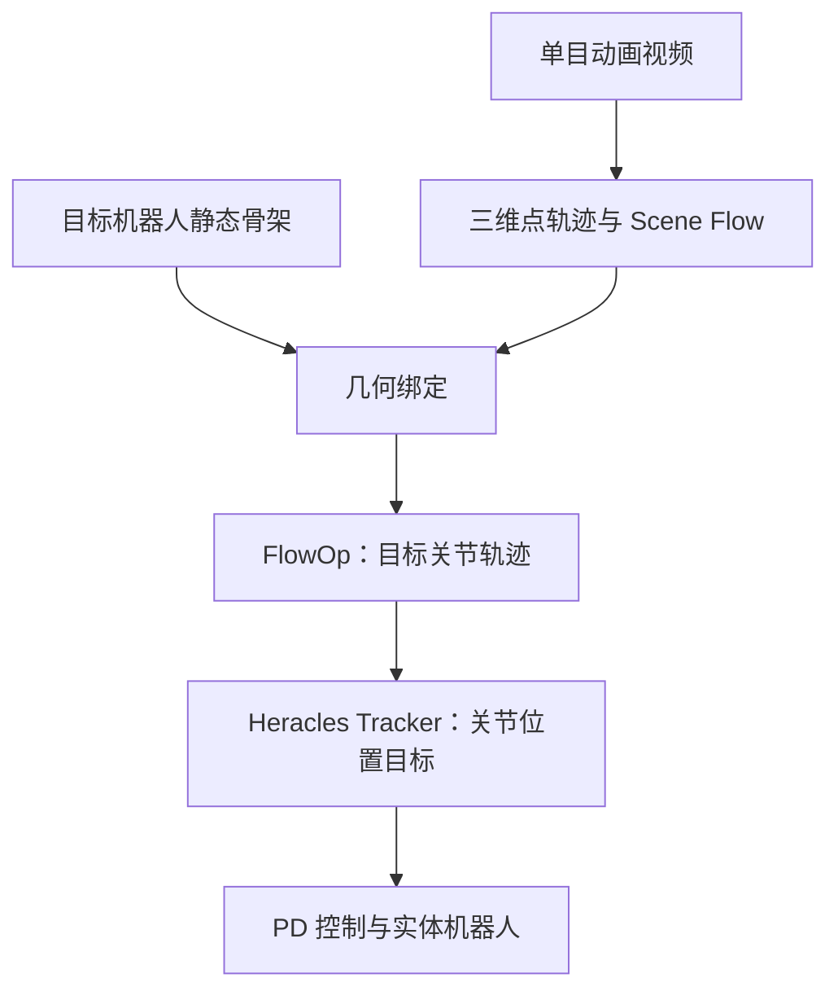

# FlowOp 论文精读、批判性分析与复现评估

> 分析对象：[FlowOp 项目页](https://flowop-submission.github.io/) · [公开论文草稿（PDF）](https://github.com/FlowOp-Submission/FlowOp-Submission.github.io/blob/source/assets/figures/paper.pdf) · [项目页仓库](https://github.com/FlowOp-Submission/FlowOp-Submission.github.io)  
> 分析日期：2026-08-06  
> 论文标题：**FlowOp: Morphology-Agnostic Animation-to-Robot Motion Retargeting via Sceneflow-Conditioned Diffusion**  
> 状态说明：项目页标注为双盲审稿；仓库中的 PDF 是一份带作者批注、占位符和未完成 checklist 的工作草稿。因此，下文不把它视为已经同行评审确认的最终论文。

## 结论先行

FlowOp 最有价值的想法，不是一个新的机器人强化学习控制器，而是一个新的**上游动作解释与跨形态重定向接口**：它尝试把动画视频先转成与源角色身份弱绑定的三维 scene flow，再用目标机器人的骨架几何查询这组运动场，最终生成目标骨架的关节轨迹。

我的总体判断是：

- **研究想法值得重点阅读**：`scene flow → geometry binding → target trajectory` 是一个清晰、可迁移的表征路线，适合作为 Tracking 系统的上游参考动作生成器。
- **现阶段不应把论文数字当成成熟结论**：核心跨形态 benchmark 是合成重绘数据，主指标移除了全局平移并按骨架尺度归一化；代码、数据、权重和关键实现细节均未发布。
- **“视频直接驱动真机”的表述偏强**：FlowOp 本体输出离线运动学轨迹；真机执行依赖另一个经过大规模动作先验预训练并再次微调的 Heracles tracker 和低层 PD 控制器。
- **最合理的复现策略是分层验证，而不是直接照着论文堆满系统**：先验证 scene flow 是否真的比 2D flow / 3D keypoint 更能支持目标骨架查询，再决定是否实现 rectified-flow DiT，最后才接入物理 tracker 和真机。

| 维度 | 判断 |
|---|---|
| 新颖性 | 中高：以 scene flow 作为 morphology-light 动作描述，再由目标骨架主动查询 |
| 方法完整度 | 中低：主干概念清楚，但若干关键变量、损失、采样过程和实现参数缺失 |
| 实验可信度 | 中：相对改进很大，但数据构造、基线数量、指标定义和真实部署证据存在明显限制 |
| 代码可复现性 | 低：当前公开仓库只有网页、媒体和论文草稿，没有方法实现 |
| 对 Tracking 路线的价值 | 高，但应定位为“参考动作生成/重定向前端”，不能替代闭环控制策略 |
| 建议 | **先做 Level 1 表征验证；暂不直接做论文级完整复现** |

---

## 0. 范围校正：这不是一篇“在线 RL Tracking Policy”论文

附件中的分析框架以 humanoid tracking / RL control 为主，因此第一步必须把 FlowOp 的任务边界校正清楚：

FlowOp 覆盖的是图中的前四步：从视频和目标骨架生成参考关节轨迹。它不直接观察机器人状态，不闭环输出力矩，也不负责跌倒恢复或 sim-to-real。论文的真机演示额外使用了 Heracles motion tracker。因而本文会分别分析：

1. **FlowOp 生成模型**：视频到目标机器人运动学轨迹；
2. **下游 tracker**：轨迹到 29-DoF 关节位置目标，再由 PD 执行；
3. **二者拼接后的系统**：项目页所称的 animation-to-robot deployment。

后文使用以下证据标记：

- **明确**：项目页或论文正文直接给出；
- **草稿缺口**：PDF 中存在占位符、作者批注或定义缺失；
- **推断**：依据结构、指标或公开材料作出的合理判断，不是作者明示结论。

---

## 1. 论文概览

### 1.1 论文试图解决什么问题

论文提出 **Morphology-Agnostic Animation-to-Robot（MA-A2R）**：输入任意单目动画视频

$$
V = \{I_t\}_{t=1}^{T}
$$

以及目标机器人的静态运动学骨架 $S$，输出目标骨架的关节级运动轨迹

$$
M_{1:T}.
$$

它强调推理时不需要源角色的 skeleton、mesh 或 body model。这一点针对的是传统重定向管线的核心依赖：先为源角色建立骨架，再做语义关节对应，最后优化到目标机器人。

### 1.2 核心贡献

论文主张的贡献可以拆成四项：

1. **任务定义**：把“任意动画视频到指定机器人动作”作为统一问题，而不是只处理 SMPL 人体或已知角色 rig。
2. **表征转换**：用世界坐标系中的三维 scene flow 表示运动，把信息从“谁的哪个关节在动”转为“空间中哪里的点如何移动”。
3. **目标侧查询**：让目标骨架的关节 token 按三维邻近关系查询视觉运动 token，避免硬编码源—目标语义关节映射。
4. **生成模型**：用 rectified-flow DiT 生成目标关节轨迹，并加入全局流条件和视觉动态辅助预测。

### 1.3 论文给出的主要结果

在作者构造的 395 段 benchmark 上，项目页报告：

- same-morphology MPJPE：**0.77**；
- cross-morphology MPJPE：**5.62**；
- 对比方法 MoCapAnything 分别为 7.14 和 32.39。

但这里的 MPJPE **不是毫米或厘米**。主表先逐帧减去 pelvis、再按 rest-pose mesh bounding box 做尺度归一化，最后把结果乘以 100 以便阅读。它衡量的是归一化后的局部姿态误差，不能直接回答全局轨迹误差、落脚误差或物理可执行性。

### 1.4 一句话定位

> FlowOp 是一个以 scene flow 为中间语言的、条件生成式跨形态运动重定向器；它生成参考轨迹，而不是直接控制机器人。

---

## 2. 问题动机与任务假设

### 2.1 为什么传统方案在动画上容易失败

传统 motion retargeting 通常隐含以下链条：

$$
\text{video} \rightarrow \text{source pose/skeleton} \rightarrow
\text{joint correspondence} \rightarrow \text{target pose}.
$$

这在真人视频上尚可借助 SMPL、人体关键点或 mocap 模型，但面对动物、卡通角色、夸张比例、缺失肢体或非刚性造型时会遇到三个问题：

- 源拓扑可能未知，标准人体模型无法拟合；
- 即使检测出“关节”，它与机器人关节的语义对应也未必成立；
- 2D 光流缺少深度，单视角下前后运动和尺度变化容易混淆。

FlowOp 的动机是：**不要先回答源角色“是什么”，而先回答空间中的表面“怎么动”**。

### 2.2 关键假设

这个方向成立需要以下假设：

1. 单目视频能够恢复足够稳定的世界坐标三维点轨迹；
2. 对目标动作有用的信息主要存在于局部空间位移，而不是严格的源骨骼语义；
3. 目标关节与视觉点云经过中心化后，三维邻近关系仍能提供可靠对应；
4. 训练数据覆盖了“视觉运动场到机器人姿态”的映射；
5. 下游 tracker 能把可能不完全物理可行的运动学轨迹投影到真机可执行域。

其中第 1、3、4 项是主要风险。尤其是单目世界坐标 scene flow 的尺度、相机运动、遮挡和深度误差可能系统性污染所有后续模块。

### 2.3 “Morphology-Agnostic” 应如何理解

论文自己的限制部分也承认它是 **morphology-light，而不是完全 morphology-blind**。同形态到跨形态时 MPJPE 从 0.77 上升到 5.62，约增大 7.3 倍。模型仍需目标 skeleton，并且训练分布决定它是否学会某类跨形态映射。

因此，更准确的表述是：

> FlowOp 去掉了推理阶段的**源骨架显式建模与源—目标关节硬对应**，但没有消除目标形态条件，也没有证明对任意未见机器人或非 humanoid 拓扑零样本泛化。

---

## 3. 完整信息流：Input → Latent → Output

### 3.1 输入

| 输入 | 形态 | 用途 | 关键依赖 |
|---|---|---|---|
| 单目动画视频 | $T$ 帧 RGB | 提供外观与运动观察 | 前景分割、深度、点跟踪、相机/世界坐标恢复 |
| 目标 rest skeleton | $K$ 个关节和 kinematic tree | 定义输出拓扑、关节位置和父子关系 | 骨架尺度、pelvis 定义、关节顺序 |
| 生成历史 | 最近若干预测帧 | 长序列连续生成 | 首窗口站立初始化；后续复用 8 帧 |
| 扩散/流噪声 | 高斯噪声 $X_0$ | 条件生成 | rectified-flow 采样实现未完整说明 |

### 3.2 三维观察构建

论文使用 [Track4World](https://github.com/TencentARC/Track4World) 从视频获得世界坐标点轨迹，并依赖 Depth Anything 3 的深度能力。得到：

$$
P \in \mathbb{R}^{(T+1) \times N \times 3}, \qquad
F \in \mathbb{R}^{T \times N \times 3},
$$

其中 $P_{t,n}$ 是第 $n$ 个点在第 $t$ 帧的三维位置，scene flow 可写成相邻帧位移：

$$
F_{t,n} = P_{t+1,n} - P_{t,n}.
$$

这一步非常关键：FlowOp 并没有从 RGB 端到端学习全部视觉几何，而是依赖一个强大的外部世界坐标跟踪/深度系统。论文标题中的 “animation-to-robot” 在工程上实际是：

$$
\text{animation} \rightarrow \text{Track4World outputs}
\rightarrow \text{FlowOp} \rightarrow \text{robot trajectory}.
$$

### 3.3 全局锚点与尺度归一化

平均 scene flow 定义为：

$$
\bar{F}_t = \frac{1}{N}\sum_{n=1}^{N}F_{t,n}.
$$

初始锚点 $h_0$ 取第一帧前景点的中位数，后续锚点通过平均流累积：

$$
a_t = h_0 + \sum_{\tau < t}\bar{F}_{\tau}.
$$

论文还按 rest-skeleton bounding-box diagonal 进行尺度归一化，但草稿内作者批注明确追问“rest-skeleton 如何定义”，说明最终规范尚未写清。

这里有一个结构性风险：全体表面点平均位移不等价于 root translation。挥臂、裙摆、尾巴、镜头残余运动以及采样密度不均都可能改变 $\bar F_t$。中位点和平均流提供了鲁棒启发式，却不是可辨识的物理根节点估计。

### 3.4 双分支编码

**视觉运动分支**把中心化点位置和 scene flow 编码为视觉 token：

$$
\big(P_{t,n}-\bar P_t, F_{t,n}\big)
\rightarrow F_{\mathrm{vis}}.
$$

**目标骨架分支**把 rest joint 坐标和 kinematic tree 编码为骨架 query：

$$
(J_{\mathrm{rest}}, \mathcal{T}_{\mathrm{kin}})
\rightarrow Q_{\mathrm{skel}}.
$$

骨架分支采用 topology-biased self-attention，使父子或图距离较近的关节更容易交换信息。这个设计比把关节 token 当作无序集合更合理，但论文未给出拓扑 bias 的全部实现细节和消融。

### 3.5 Geometry Binding

目标关节以 pelvis 为中心，视觉点以每帧点云中心为原点，然后进行 joint-to-point cross-attention。论文可概括为：

$$
F_{\mathrm{bnd}} =
\operatorname{Attn}\left(
Q_{\mathrm{skel}} + \psi(J_c),
F_{\mathrm{vis}} + \psi(P_c)
\right),
$$

其中 $\psi(\cdot)$ 是空间位置编码。

它的直觉是：目标的左手关节不必知道源角色“左手”的标签，只要在归一化空间中查询对应区域的运动即可。这个模块是整篇论文最值得借鉴的部分。

但草稿对 $\psi$ 是正弦编码还是 MLP、attention 的 key/value 构造等仍留有作者批注，且没有以下关键消融：

- 无 geometry binding；
- 全局 cross-attention 对比三维邻近 attention；
- 无 topology bias；
- 不同坐标中心化和尺度规范。

因此尚不能从实验上确定收益究竟来自 scene flow、几何位置编码，还是更大的条件生成网络。

### 3.6 时序融合与生成主干

绑定后的关节 token 经 causal temporal fusion 形成时序特征，再送入 12-block Spatio-Temporal DiT。DiT 同时接收：

- 视觉—骨架绑定特征；
- 目标骨架条件；
- 最近生成历史；
- 噪声状态 $X_s$；
- 平均 scene flow 形成的全局条件。

论文采用 $x_1$-prediction 形式的 rectified flow：在噪声和干净轨迹之间采样中间状态 $X_s$，网络直接预测干净终点 $\hat X_1$。主损失为深度加权 L1：

$$
\mathcal{L}_{x_1}
= \mathbb{E}_{s,\epsilon}
\left[
\sum_{t,k}
\left(1+\beta\,\operatorname{depth}(k)\right)
\left\|\hat X_{1,t,k}-X_{1,t,k}\right\|_1
\right],
\qquad \beta=0.3.
$$

更深的末端关节获得更高权重，等效应约为 root 的 2.5–3.1 倍。

**草稿缺口**：没有完整给出 $X_s$ 的插值式、velocity-field 等价形式、ODE 求解器、推理步数和采样 schedule。草稿还把 $X_1$ 写成 $T\times K\times4$，旁边却留下“4 是否表示 quaternion”的作者批注；后文解码又描述为 root offset 和 pelvis-relative joint offset，二者维度并不自洽。实现时不能仅凭本文恢复精确输出张量。

Rectified Flow 和 DiT 的原始背景可分别参考 [Rectified Flow](https://arxiv.org/abs/2209.03003) 与 [Scalable Diffusion Models with Transformers](https://arxiv.org/abs/2212.09748)。

### 3.7 Flow-Augmented AdaLN 与 VDHead

平均 scene flow 经线性层形成：

$$
g_t^{\mathrm{flow}} = W_{\mathrm{flow}}\bar F_t,
$$

再注入 AdaLN，以强化全局运动方向与速度条件。VDHead 则在训练时预测未来视觉动态，作为辅助监督；推理时移除。

完整损失写作：

$$
\mathcal{L}
= \mathcal{L}_{x_1}
+ \lambda_{\mathrm{vd}}\mathcal{L}_{\mathrm{vd}}
+ \mathcal{L}_{\mathrm{aux}},
$$

其中 $\lambda_{\mathrm{vd}}=0.05$。但 PDF 中 VDHead 的具体公式仍是 `Eq. ??`，无法精确复现。

### 3.8 输出与长序列拼接

论文描述输出为 root offset $r_t$ 和 pelvis-relative joint offsets $q_{t,k}$：

$$
p_{t,0}=a_t+r_t,
\qquad
p_{t,k}=p_{t,0}+q_{t,k}.
$$

长序列以 256 帧窗口生成，相邻窗口重叠 32 帧，并用 Hann window 混合；首窗口使用站立姿势历史，后续窗口复用最近 8 帧。

这一策略能缓解边界跳变，但它仍是离线/分块生成方案，不是依据机器人实时状态逐帧闭环修正的 policy。

---

## 4. Action Representation：到底输出了什么

### 4.1 FlowOp 的“动作”不是控制动作

FlowOp 本体输出的是目标骨架的运动学轨迹，主要由：

- root/global anchor 相关位移；
- pelvis-relative joint positions；
- 可能的附加 1 维状态（草稿的四维定义不清）；
- 辅助的速度、接触或姿态约束所塑造的隐含运动属性

组成。它没有直接输出：

- 关节力矩；
- 残差力；
- 足底接触力；
- PD gain；
- 机器人当前状态反馈下的闭环 action。

因此，不能把 FlowOp 的 MPJPE 与一个 RL tracker 的 tracking error 或 success rate直接等价比较。

### 4.2 下游 tracker 的 action

真机系统中，Heracles tracker 最终输出：

$$
a_t \in \mathbb{R}^{29},
$$

对应 Unitree G1 的 29 个关节位置目标，再由低层 PD 控制器执行。论文一处称 G1 为 “35-joint”，这里很可能混用了 body/joint count 与受控 DoF，属于文稿定义不统一。

### 4.3 这种 representation 的优缺点

| 设计 | 优点 | 风险 |
|---|---|---|
| 关节位置轨迹 | 易监督、易可视化、可接多种 tracker | 不包含动力学可行性；高速动作可能严重失真 |
| pelvis-relative joints | 弱化全局尺度与漂移，利于跨形态 | 可能掩盖 root translation 失败和落脚位置错误 |
| anchor + root residual | 将全局运动与局部姿态解耦 | 平均 scene flow 不是可靠 root estimator |
| 生成式轨迹 | 可表达一对多映射与平滑先验 | 推理开销、采样稳定性和随机性未报告 |
| PD joint targets | 真机控制接口简单、已有成熟 tracker | 依赖 tracker 先验，不能证明上游轨迹本身物理有效 |

---

## 5. Policy / Model Architecture 深入分析

### 5.1 它更像 conditional motion generator，而非 policy

标准 policy 学习的是：

$$
\pi(a_t \mid o_t, r_t),
$$

其中 $o_t$ 含机器人实时状态，$r_t$ 是参考动作。FlowOp 更接近：

$$
p(M_{1:T}\mid V_{1:T},S),
$$

即条件轨迹生成。真正的 policy 是其下游 Heracles tracker。

### 5.2 架构合理性

**合理之处：**

- 双分支保留“观察运动”和“目标拓扑”两类结构差异；
- 关节 query 对点 token 的 cross-attention 符合目标驱动重定向逻辑；
- 空间 attention 与时间 attention 分离，适合 $T\times K$ token；
- causal history 与窗口重叠为长序列一致性提供工程补丁；
- FA-AdaLN 提供显式全局位移信号，VDHead 强迫条件编码器保留未来动态。

**不确定之处：**

- 12-block DiT 是否必要，没有与 deterministic transformer / MLP regression 对比；
- 没有报告 model width、heads、parameter count、FLOPs、推理步数；
- 没有说明不同 target skeleton 的 joint token 如何 batching、masking；
- “任意 $K$”只在结构层面成立，不等于模型对未见 $K$ 有训练外泛化；
- rectified flow 解决的是多模态生成，论文却没有展示同一视频的多样化样本或不确定性校准。

### 5.3 Rectified flow 是否真的必要

作者把一对多的跨形态映射作为生成建模理由，这是成立的：同一只卡通生物的表面动作可能对应多种机器人关节解释。但主 benchmark 每个输入只有单一 ground truth，评价也是点对点 MPJPE。没有以下实验：

- RF vs deterministic $x_1$ regression；
- 不同采样步数的质量—延迟曲线；
- 多样性与准确度 trade-off；
- 条件不确定性与失败预测。

所以目前能确认的是“一个 RF-DiT 系统有效”，不能确认“RF 是有效性的必要来源”。

### 5.4 下游 Heracles tracker 架构

tracker 的观察包括：

$$
o_t = [p_t, m_t, z_d],
$$

其中 proprioception $p_t$ 包括 projected gravity、root angular velocity、关节位置偏差、关节速度与上一动作；reference $m_t$ 包括目标 root 线/角速度、root orientation error（Rot6D）和参考关节位置。

未来 10 帧、50 Hz 的参考动作先由 motion encoder 编成 256 维连续 latent，再用 finite scalar quantization 得到 8 个取值为 $0\ldots7$ 的离散码：

$$
z_d \in \{0,\ldots,7\}^{8},
\qquad |\mathcal{Z}|=8^8\approx 16.7\text{M}.
$$

动作解码器结合 motion token 和最近 10 帧 proprioceptive history 输出 29-DoF 关节目标。这个强 motion prior 很可能承担了大量“把不完美 reference 修正为可执行动作”的工作。

---

## 6. Contact、Force 与 Physics

### 6.1 FlowOp 本体使用了哪些物理约束

第二阶段的辅助损失为：

$$
\begin{aligned}
\mathcal{L}_{\mathrm{aux}}={}&
2.0\mathcal{L}_{\mathrm{traj}}
+0.3\mathcal{L}_{\mathrm{root\_vel}}
+1.0\mathcal{L}_{\mathrm{pos}}\\
&+0.5\mathcal{L}_{\mathrm{vel}}
+0.5\mathcal{L}_{\mathrm{bone}}
+0.2\mathcal{L}_{\mathrm{pen}}
+0.1\mathcal{L}_{\mathrm{contact}}.
\end{aligned}
$$

这些损失约束轨迹、速度、骨长、地面穿透和接触分类。它们是**运动学正则项**，不是完整刚体动力学或可微分接触模拟。

### 6.2 明确缺少什么

FlowOp 不显式建模：

- 质量、惯量和质心；
- 关节 torque limit；
- friction cone；
- ground reaction force；
- center of pressure / ZMP；
- 自碰撞与环境碰撞；
- 物体接触及其时序约束。

$\mathcal{L}_{\mathrm{contact}}$ 是接触标签相关的 BCE，$\mathcal{L}_{\mathrm{pen}}$ 主要抑制穿地。二者不能保证动态平衡。

### 6.3 物理可执行性由谁负责

主要由下游 RL tracker、domain randomization、奖励与 PD 控制负责。tracker 的奖励使用指数核跟踪 root/body position、orientation、linear/angular velocity，并加入：

- action smoothness penalty：权重 $-0.1$；
- joint-limit penalty：权重 $-10$；
- 非足部意外接触 penalty：权重 $-0.1$。

这种设计能把运动学 reference 投影到机器人可行域，但也意味着真机成功不能完全归因于 FlowOp。

### 6.4 接触相关结论

> FlowOp 对接触的处理足以减少明显穿地和鼓励脚部事件一致，但远不足以支持“接触丰富、物理可执行”的强结论。当前展示主要是平地舞蹈/姿态模仿，尚未覆盖推拉物体、攀爬、坐靠、手部支撑或复杂地形。

---

## 7. 数据与训练流程

### 7.1 AnimBot 的构造链条

项目页称 AnimBot 包含 7,800+ paired clips，覆盖人、动物和 stylized characters。论文揭示的构造逻辑是：

1. 从 AMASS 等 motion 数据得到人体动作；
2. 先把 motion retarget 到目标机器人，形成 ground-truth robot trajectory；
3. 渲染机器人动作视频；
4. 用 Wan2.2 对视频进行角色重绘/动画化，得到不同外观和形态的 source animation；
5. 以原机器人轨迹作为训练标签。

### 7.2 Benchmark 的关键筛选

作者为 benchmark 采用 raw-GT source pose substitution 和 2D pelvis anchoring，并人工审核；最终只有 **395 段**通过。明显漂移、肢体缺失和时序不一致的生成视频被排除。

这带来三个重要解释：

1. cross-morphology 的 source appearance 虽然多样，但底层动作源自同一套可被机器人执行的 motion；
2. 数据不是“自然存在的任意动画”，而是从机器人/人体动作经过可控重绘得到；
3. 人工剔除失败视频会抬高视觉前端的可用性，并弱化真实世界生成瑕疵。

所以主 benchmark 更接近：

> 在保持底层动作相对一致的条件下，测试模型能否跨越外观、比例和表面形态变化恢复机器人轨迹。

它尚未充分测试：独立创作动画、真正不同的肢体拓扑、镜头运动、遮挡、物体交互、非机器人可行动作。

### 7.3 训练设置

| 项目 | 论文给出的设置 |
|---|---|
| 硬件 | 8 × NVIDIA A100，bf16 |
| Stage 1 | 50 epochs；2-block scaffold DiT；主要使用 $\mathcal L_{x_1}$ 与 trajectory loss |
| Stage 2 | 100 epochs；完整 12-block 模型与全部损失 |
| 编码器策略 | Stage 2 前 10 epochs 冻结，之后联合训练 |
| 优化器 | AdamW |
| 学习率 | DiT $3\times10^{-4}$；encoder $3\times10^{-5}$ |
| 调度 | 5-epoch warmup + cosine decay |
| 流时间采样 | 80% logit-normal，20% uniform |
| 历史条件 | 60% standing cold-start，40% noisy ground truth |
| 统计 | 主结果平均 3 个随机种子 |

### 7.4 缺失的训练信息

论文没有给出：

- batch size / effective global batch；
- A100 是 40 GB 还是 80 GB；
- 每个 epoch 的样本/帧定义；
- 总训练 wall-clock time；
- gradient accumulation、clipping 和 weight decay；
- 数据 train/val/test 的精确划分及身份泄漏防护；
- scene-flow preprocessing 的时长、缓存格式和失败率；
- 模型宽度、head 数、参数量与 checkpoint selection；
- 数据集与生成素材的完整许可证。

这些缺口使得即使数据发布，第三方仍很难按论文精确预算复现。

### 7.5 下游 tracker 训练

tracker 先在大规模动作库上预训练：

- 12,500 段 AMASS locomotion；
- 8,200 段 retargeted motion；
- 3,800 段 synthetic motion。

论文报告 PPO 使用 batch 4096、30,000 updates，约在 8 × RTX 4090 上训练 10 小时；随后用 FlowOp 输出再 fine-tune 5,000 updates，学习率 $10^{-4}$。文本中并行环境数写作 8，但若确实只有 8 个并行环境而 batch 为 4096，需要更详细的 rollout/mini-batch 定义才能解释。

### 7.6 Domain randomization

论文列出的 randomization 包括：

- target joint position noise：$\pm0.01$ rad；
- target angular velocity noise：$\pm0.2$；
- root rotation noise：$\pm0.05$；
- nominal joint shift：$\pm0.01$；
- COM shift：$x\pm0.5$ m，$y,z\pm0.1$ m；
- static friction：0.3–1.6；dynamic friction：0.3–1.2；
- 每 1–3 秒随机 root push：线速度与角速度扰动。

其中 COM 的 $x\pm0.5$ m 对人形机器人而言非常大，可能是草稿单位、坐标或参数笔误，至少应要求作者澄清。

---

## 8. 实验设计与结果解读

### 8.1 主指标到底测量什么

主表对每帧做 pelvis root alignment，并按 rest-pose mesh bounding box 归一化，然后把值乘 100。指标包括：

- MPJPE：平均关节位置误差；
- MPJVE：平均关节速度误差；
- CD-Skeleton：关节到骨段的对称 Chamfer 距离。

这套指标适合评估**局部姿态重建**，但主动移除了两个机器人控制最重要的量：全局位移与物理尺度。一个模型即使 root trajectory 漂移、步长错误或脚落点偏移，也可能保持很低的 root-aligned MPJPE。

### 8.2 主结果

| 方法 | Same MPJPE ↓ | Same MPJVE ↓ | Same CD ↓ | Cross MPJPE ↓ | Cross MPJVE ↓ | Cross CD ↓ |
|---|---:|---:|---:|---:|---:|---:|
| MoCapAnything | 7.14 | 0.80 | 0.23 | 32.39 | 1.87 | 0.44 |
| FlowOp | **0.77** | **0.11** | **0.01** | **5.62** | **0.40** | **0.13** |

结果显示 FlowOp 在作者 benchmark 上显著优于唯一主基线。但证据边界如下：

- 只有一个主基线，无法定位增益来自 scene flow、目标骨架条件、DiT 容量还是数据拟合；
- same 与 cross 使用同一组 395 个底层 motion，不能视为独立动作分布；
- 没有 raw global trajectory error、foot sliding、contact F1、penetration、joint-limit violation；
- 没有真实动画的定量 ground truth；
- 没有真机 tracking success / fall rate / JPE 表格。

### 8.3 In-the-wild 结果

项目页展示 9 段训练中未见的 OOD animation，覆盖 stylized characters 等。它们能证明方法对部分真实/网络动画有视觉可用性，但目前只有 qualitative videos，没有：

- ground-truth target motion；
- 人工偏好评分；
- 独立专家打分；
- foot sliding / penetration 自动指标；
- 失败样本全集或选择协议。

所以它们属于 demo evidence，不能替代 benchmark。

### 8.4 真机结果

项目页展示 Unitree G1 动作执行视频；论文定义了 JPE、root velocity error 和 30 秒不跌倒 success，但未提供对应的定量结果表。由此只能确认“作者展示的若干动作可执行”，不能判断：

- 总测试动作数与成功比例；
- 是否只展示成功样本；
- FlowOp reference 相比 GT-retargeted reference 造成多少性能损失；
- tracker fine-tune 前后的增益；
- 不同随机种子、地面和电量条件下的稳定性。

### 8.5 实验中最需要补充的对比

1. scene flow 与真正强 3D tracker / monocular pose pipeline 的端到端对比；
2. FlowOp 与 [GMR](https://github.com/YanjieZe/GMR)、[SAME](https://github.com/sunny-Codes/SAME)、[MoReFlow](https://dnjsxor999.github.io/projects/MoReFlow/MoReFlow.html) 在可重叠设置上的比较；
3. RF-DiT vs deterministic transformer；
4. predicted scene flow vs oracle scene flow；
5. 无目标骨架 topology bias、无 geometry binding、不同空间编码；
6. root-aligned 指标之外的 global JPE、root drift、contact、foot skating；
7. 真机上 GT reference / GMR reference / FlowOp reference 的相同 tracker 控制变量实验。

---

## 9. 实时性、部署与系统复杂度

### 9.1 是否实时

FlowOp 采用 256 帧窗口、32 帧 overlap 的分块生成，且依赖前置三维跟踪与 rectified-flow 迭代采样。论文没有报告：

- Track4World 单帧或单 clip 速度；
- FlowOp sampler steps；
- 端到端延迟；
- GPU 显存；
- 实时因子（RTF）；
- 是否能流式处理尚未完成的视频。

因此不能宣称 FlowOp 本体实时。较稳妥的系统解释是：**先离线处理动画得到完整 reference，再由 tracker 在线以约 50 Hz 执行。**

### 9.2 真机控制频率

tracker 的未来参考窗口是 10 帧 @ 50 Hz，说明 policy/reference interface 至少按 50 Hz 组织。论文没有报告低层 PD 的实际频率、通信延迟、上位机/板载部署位置和安全机制。

### 9.3 部署依赖

| 层 | 依赖 | 是否公开可直接复现 |
|---|---|---|
| 视频三维重建 | Track4World、Depth Anything 3、前景处理 | 上游部分公开；完整预处理 glue code 未公开 |
| FlowOp 轨迹生成 | 双分支 encoder、binding、12-block DiT、VDHead | 否 |
| 数据 | AnimBot 7,800+、395 benchmark | 否 |
| 控制 | Heracles-based tracker、运动 latent、PPO fine-tune | 本文版本未公开 |
| 仿真 | Unitree G1 model、奖励、随机化、PD | 参数部分给出，完整环境未公开 |
| 真机 | G1、上位机、急停/安全设施 | 无部署代码与协议 |

### 9.4 “End-to-end” 表述审计

项目页称从 monocular animation 到真实机器人是 end-to-end，并强调不需 per-clip tuning 或额外 motion priors。严格看，这种措辞容易误导：

- 视频先经过独立的 Track4World / depth 系统；
- FlowOp 是离线 trajectory generator；
- 真机依赖一个在约 24,500 段 motion 上预训练的离散 motion-latent tracker；
- tracker 还需使用 FlowOp 输出 fine-tune 5,000 PPO updates。

所以更准确的说法是“用户侧无需为每个 clip 手工重定向，但系统内部是多阶段 pipeline，并依赖强 motion prior”。

---

## 10. Ablation：哪些结论成立，哪些还没被证明

### 10.1 描述符消融

论文在 300 个 held-out clips、$N=4096$ points、关闭 FA 与 VD 的同架构条件下比较：

| 描述符 | RAW-MPJPE ↓（mm） | Ag ↑ | Cp ↑ | Un ↑ |
|---|---:|---:|---:|---:|
| 3D tracking | 434.20 | 0.97 | 0.03 | 0.70 |
| Optical flow | 502.20 | 0.99 | 0.00 | 未定义 |
| Scene flow | **152.60** | 0.98 | **0.75** | **0.80** |

表面上这强力支持 scene flow。需要注意，论文里的“3D tracking”并不是一个完整强基线，而是围绕检测/参考骨架关节采样各向同性高斯点，模拟 category-specific tracker 输出；optical flow 则由 WAFT 得到后再抬升到三维，天然缺少可靠 depth motion。

此外 Ag、Cp、Un 不是直接估计互信息，而是用线性 Ridge probe 和人工定义 proxy：

- Ag：视角距离与类别泄漏；
- Cp：深度轴关节速度与非关节表面速度；
- Un：按 GT joints 划分的 10 个 canonical body regions 上的熵。

这些诊断指标确实对应作者讨论的 failure mode，但也与 scene flow 的预期优势高度同构；Un 还依赖 canonical human body regions，与“任意 morphology”主张存在张力。

### 10.2 模块消融

| 变体 | RAW-MPJPE ↓（mm） | PA-MPJPE ↓（mm） |
|---|---:|---:|
| 无 FA、无 VD | 152.6 | 82.3 |
| 仅 FA | 94.2 | 80.5 |
| 仅 VD | 67.2 | 17.4 |
| FA + VD | **20.2** | **10.0** |

可得出的结论：

- FA 主要改善全局/原始坐标误差，PA-MPJPE 改善有限，符合它注入 mean flow 的设计；
- VD 显著改善对齐后的局部姿态；
- 二者组合存在明显互补。

不能得出的结论：

- 这些模块是否在 cross-morphology 上同样有效；
- geometry binding 是否必要；
- topology-biased attention 是否提高未见 skeleton 泛化；
- DiT / rectified flow 是否优于确定性预测；
- history token 与窗口融合是否真正减少长时漂移。

### 10.3 最关键的缺失消融

建议复现时优先补以下四组，而不是照搬所有小模块：

1. `scene flow + geometry binding` vs `scene flow + global pooling`；
2. oracle scene flow vs Track4World predicted flow；
3. deterministic predictor vs 2-block RF vs 12-block RF；
4. same/cross/unseen-target-skeleton 三个 split 同时报告 global 与 root-aligned metrics。

---

## 11. 局限、失败模式与潜在 Hype

### 11.1 论文明确承认的局限

- scene flow 不是完全 morphology-blind；
- 当前只在 Unitree G1 目标上验证；
- 结构上支持可变 $K$ 不等于对新机器人零样本可用；
- quadruped / multi-legged 等非 humanoid topology 不保证可执行。

### 11.2 数据闭环与 benchmark 偏差

训练/测试标签先由机器人可执行 motion 产生，再把对应渲染重绘成多种角色。这样保证了 paired supervision，却形成一种“标签先验闭环”：模型看到的 cross-morph source 本质上承载的是已经适配机器人动作空间的运动。

这可能高估模型处理真正任意动画的能力。例如：

- 四足角色做非双足 gait；
- 角色有尾巴、翅膀或多臂；
- 动画依赖弹性形变而非关节运动；
- 角色完成机器人无法执行的高速旋转或大幅跳跃。

### 11.3 视觉前端失败会如何传播

潜在 failure chain：

$$
\text{遮挡/镜头运动/深度错误}
\rightarrow \text{scene-flow 偏差}
\rightarrow \text{错误 anchor 与 geometry binding}
\rightarrow \text{轨迹漂移}
\rightarrow \text{tracker 过度修正或跌倒}.
$$

论文没有把 Track4World confidence、遮挡 mask 或预测不确定性传给 FlowOp。模型看不到“这部分 scene flow 不可信”，因而很难在上游主动降权或让下游进入安全模式。

### 11.4 动态可行性缺口

运动学损失不能保证：

- 支撑多边形内稳定；
- torque/velocity limit 满足；
- 足底无滑动；
- 跳跃落地冲击可承受；
- 自碰撞与环境碰撞安全。

真机 tracker 可以修正一部分，但修正后的动作可能已偏离 source animation；论文没有同时报告 visual fidelity 与 physical feasibility 的 Pareto 曲线。

### 11.5 文稿成熟度红旗

公开 PDF 中仍可见：

- 关于 rest-skeleton 定义的作者批注；
- 对位置编码、attention key/value 的追问；
- 对 $X_1\in\mathbb{R}^{T\times K\times4}$ 第四维含义的追问；
- `Eq. ??`、`Table ??` 和 `xxx` 项目页占位；
- 空白的 “Additional Experimental Results”；
- NeurIPS checklist 全部为 `[TODO]`。

这些不必然说明方法无效，但说明当前 PDF 是内部草稿级证据。任何复现都应等待或主动索取最终公式、代码和数据规范。

### 11.6 可能被宣传放大的三句话

| 宣传式表述 | 更严谨的改写 |
|---|---|
| Morphology-agnostic | 无需显式源骨架映射的 morphology-light retargeting；目标骨架和训练分布仍很关键 |
| End-to-end video-to-robot | 多阶段 video preprocessing + trajectory generation + pretrained RL tracker + PD control |
| Directly drives the real robot | 生成 reference trajectory，再由经过预训练和 FlowOp-specific fine-tune 的 tracker 执行 |

---

## 12. 与 BeyondMimic 的比较

参考：[BeyondMimic 项目页](https://beyondmimic.github.io/) · [论文](https://arxiv.org/abs/2508.08241) · [公开 Whole-Body Tracking 仓库](https://github.com/HybridRobotics/whole_body_tracking)

### 12.1 二者不是同一层的直接竞品

| 维度 | FlowOp | BeyondMimic |
|---|---|---|
| 核心问题 | 任意动画视频如何转成目标骨架轨迹 | 机器人如何跟踪动作并组合在线任务约束 |
| 输入 | 视频 scene flow + target skeleton | 机器人 state、motion/history、任务 cost/guidance |
| 输出 | 离线/分块关节运动学 reference | 在线 state-action trajectory / PD joint targets |
| 主要模型 | 双分支 encoder + geometry binding + RF-DiT | RL expert trackers + guided diffusion policy |
| 物理闭环 | 无，依赖外部 tracker | 有，设计核心就是 dynamics-aware execution |
| morphology 重点 | 跨 source appearance / topology | 固定机器人上的全身控制与任务泛化 |
| 真机证据 | 定性演示，无主定量表 | waypoint、joystick、obstacle avoidance 等系统实验 |
| 开源情况 | 仅网页，无方法代码 | motion tracker 已开源；完整 guided diffusion 可用性需单独核对 |

### 12.2 Action representation 对比

FlowOp 的输出是关节位置轨迹，随后 Heracles 输出 29-DoF PD target。BeyondMimic 从 expert tracker 的 state-action trajectories 学习联合生成；其低层 action 同样落在 normalized joint-position setpoint，形如：

$$
q^{\mathrm{target}} = q^{\mathrm{nominal}} + \alpha a,
\qquad \alpha=0.25\frac{\tau_{\max}}{k_p}.
$$

因此两者的下游接口其实容易衔接：FlowOp 可以产生参考 motion，BeyondMimic-style tracker / diffusion controller 可以负责物理执行和在线约束。

### 12.3 时序与在线性

BeyondMimic 使用 4 帧历史、16 帧预测 horizon、8 帧 action horizon，6-layer、4-head、512-dim transformer decoder，约 19.95M 参数，并报告 20 个 denoising steps。其 TensorRT 推理在 RTX 4060 mobile 上约 20 ms，并采用异步执行和 action-delay randomization。

FlowOp 则没有报告 sampler steps 或延迟，且 256 帧窗口更像离线 reference synthesis。因而如果用户的重点是在线 tracking/control，BeyondMimic 更接近核心控制栈；如果重点是把没有骨架的动画变成 reference，FlowOp 更相关。

### 12.4 实验成熟度

BeyondMimic 对 sim task 使用多次评估并报告 success，例如 body-position state 在扰动和 joystick 设置中的成功率；FlowOp 的真机部分只有选定视频，没有控制组和成功率。另一方面，FlowOp 解决了 BeyondMimic 默认不覆盖的 source-motion acquisition 问题。

### 12.5 最合理的组合

推荐系统边界是：

$$
\text{Animation Video}
\xrightarrow{\text{FlowOp-like frontend}}
\text{Robot Reference}
\xrightarrow{\text{BeyondMimic/Heracles}}
\text{Feasible State-Action Sequence}.
$$

这里应加入两个接口：

1. 上游输出 confidence / uncertainty / contact probability；
2. 下游返回 feasibility score 或 reference projection residual。

这样可以避免把视觉误差无条件传到真机。

---

## 13. 代码、仓库审计与复现路线

### 13.1 官方仓库审计

[FlowOp-Submission/FlowOp-Submission.github.io](https://github.com/FlowOp-Submission/FlowOp-Submission.github.io) 当前是项目展示站点。默认分支为 `source`，包含 Vite/React 页面、图像、演示视频和 PDF，但未发现：

- model / training / inference source code；
- environment 与 dependency lockfile（网页依赖除外）；
- dataset loader 或 AnimBot 下载；
- config、checkpoint、evaluation script；
- simulator、G1 controller 或 deployment code；
- 软件许可证。

| 检查项 | 状态 | 评价 |
|---|---|---|
| 方法代码 | 缺失 | 无法运行论文模型 |
| 数据/下载脚本 | 缺失 | 无法重建官方 split |
| 预训练权重 | 缺失 | 无法验证项目页 demo |
| 配置与 seed | 缺失 | 无法精确重现实验 |
| 控制/真机代码 | 缺失 | 无法复现部署 |
| 网页和媒体 | 完整 | 可核对 qualitative claims |
| License | 缺失 | 复用边界不明 |

结论：**这是展示仓库，不是可复现的研究代码仓库。**

### 13.2 可利用的相关开源项目

| 项目 | 能提供什么 | 不能替代什么 | 建议用途 |
|---|---|---|---|
| [Track4World](https://github.com/TencentARC/Track4World) | 世界坐标点轨迹/scene flow 上游 | FlowOp binding 与生成模型 | Level 1 首选视觉前端 |
| [GMR](https://github.com/YanjieZe/GMR) | 多机器人通用运动重定向、实用脚本和 robot assets | 任意动画 source 的无骨架理解 | 作为 target-side baseline / fallback |
| [SAME](https://github.com/sunny-Codes/SAME) | skeleton-agnostic character animation latent 与训练代码 | 单目视频 scene flow、物理控制 | 验证 target skeleton conditioning 思路 |
| [MoReFlow](https://dnjsxor999.github.io/projects/MoReFlow/MoReFlow.html) | VQ motion latent + flow matching 的跨形态思路 | 当前未见等价完整 FlowOp 实现 | 概念对比与生成 baseline |
| [MoCapAnything V2](https://animotionlab.github.io/MoCapAnythingV2/) | animation mocap 基线和问题设定 | 目标机器人物理执行 | 复建主 baseline |
| [BeyondMimic tracking](https://github.com/HybridRobotics/whole_body_tracking) | 已开源的全身 motion tracker | 视频到 reference | 下游控制原型 |

需要注意：搜索结果中存在第三方 `MocapAnything` reimplementation，不能默认为论文官方实现；应优先从论文项目页确认代码链接与 commit。

### 13.3 复现难度矩阵

| 子问题 | 难度 | 原因 |
|---|---|---|
| 读懂整体概念 | 中 | 架构主线清晰，但草稿公式不完整 |
| 搭建视觉预处理 | 高 | 单目世界坐标、mask、scale、point sampling 与失败处理复杂 |
| 复建 AnimBot | 很高 | 原始 motion、机器人 retarget、渲染、Wan2.2 重绘、人工审核均需实现 |
| 实现 geometry binding | 中 | 原理直接；位置编码和拓扑 bias 细节缺失 |
| 实现 RF-DiT | 高 | 张量定义、采样器、模型尺寸和条件注入不完整 |
| 复现主指标 | 很高 | 官方数据、split、mesh normalization 未发布 |
| 训练下游 tracker | 高 | 仿真、运动库、reward 和大量 PPO 工程 |
| Sim-to-real | 很高 | G1 参数、延迟、安全、PD 和硬件调试 |
| 真机复现 | 极高 | 代码缺失且风险与成本高 |

### 13.4 Level 1：最小可验证原型

**目标：**只验证论文最重要的科学假设——scene flow + target geometry query 是否比 keypoint/2D flow 更适合跨形态重定向。

建议范围：

1. 选择 5–10 段可控动画和 1 个 humanoid target skeleton；
2. 用 Track4World 提取 $P,F$，缓存为明确的数据 schema；
3. 实现 mean-flow anchor、中心化、尺度归一化和点云可视化；
4. 实现轻量 geometry-binding transformer，不上完整 DiT；
5. 使用 deterministic trajectory regression 作为第一版；
6. 对比 2D optical flow、3D keypoints、scene flow；
7. 输出 global MPJPE、root-aligned MPJPE、foot sliding、contact F1；
8. 用 GMR 或现有 tracker 可视化目标轨迹，但不做真机。

**成功门槛：**

- scene flow 在 cross-appearance clips 上稳定优于其他描述符；
- 误差提升不是只来自 root alignment；
- 遮挡、镜头运动和深度失败可以被检测；
- geometry binding attention 与人体局部区域具有可解释对应。

**预计资源：**1 名研究工程师 2–4 周；1 张 24 GB GPU 可做小规模模型和上游推理，部分大模型可能需要 A100/H100 或降分辨率。此预算是工程估算，不是论文报告。

### 13.5 Level 2：论文级模型复建

**目标：**在自建 paired 数据上复现双分支 encoder、12-block RF-DiT、FA-AdaLN 和 VDHead。

工作包：

1. 构造不少于数百段 paired clips 的 mini-AnimBot；
2. 固定 train/val/test motion split 与 character-identity split；
3. 明确定义 $X_1$、RF interpolation、sampler、步数和所有 tensor shape；
4. 先训练 2-block scaffold，再扩展 12-block；
5. 复现 depth-weighted L1 和全部 auxiliary losses；
6. 完成 scene-flow/oracle、binding、topology、RF、FA、VD 消融；
7. 同时报告 mean±std、global/raw、root-aligned、contact 与运行效率；
8. 公开数据 provenance 与许可证清单。

**预计资源：**论文原设置为 8 × A100、共 150 epochs，但未报告时长。若从零重建数据与代码，建议按 2–3 名工程/研究人员、6–12 周准备；训练资源至少预留 8 × A100 数天到数周，并以 Level 1 profiling 决定。不要把这个区间当成论文的官方成本。

### 13.6 Level 3：闭环控制与真机

**目标：**把 FlowOp-like reference 接到成熟 tracker，量化视觉 fidelity、物理 feasibility 与安全性的权衡。

建议实验：

1. 先在仿真中对同一动作比较 GT reference、GMR reference 和 FlowOp reference；
2. 记录 tracker residual、JPE、root velocity error、contact、energy、fall rate；
3. 加入 reference uncertainty 与 feasibility gating；
4. 只对通过 joint/velocity/contact/COM 安全检查的 clip 做真机；
5. 真机按静态姿态、慢速上肢、原地舞蹈、行走、快速动作逐级放开；
6. 报告所有尝试而不是只报告成功视频。

**预计资源：**若复用公开 tracker，仿真集成仍需 4–8 周；论文自己的 tracker 预训练报告约 8 × RTX 4090、10 小时，另加 5,000-step fine-tune，但环境复建与调参时间通常远高于纯训练时间。真机需 Unitree G1、保护架/软垫、急停和至少两人安全操作。

### 13.7 开工前应向作者索取的最小清单

1. 最终版 PDF 与完整公式；
2. $X_1$、condition token、mask 和 positional encoding 的精确定义；
3. model config、参数量、sampler 与推理步数；
4. AnimBot 数据 schema、395-clip split 与许可证；
5. Track4World preprocessing config、mask/scale/point sampling；
6. 训练 batch、wall-clock、A100 型号和 seed；
7. Heracles tracker 的代码、G1 asset、PD gains 与 control rate；
8. 真机全部测试列表、失败率和安全筛选规则。

---

## 14. 最终判断

### 14.1 最重要的学术贡献

**用 scene flow 取代 source skeleton 作为跨形态动作中间语言，并让 target skeleton 通过三维几何邻近主动查询运动场。**

这个抽象比“从动画先恢复标准人体骨架”更适合非真人外观，也比纯 2D optical flow 保留更多深度运动信息。它值得被单独抽出来验证，而不必绑定整套 DiT 和真机 pipeline。

### 14.2 最可信的实验结论

在作者构造的合成跨外观 benchmark 上，scene-flow-conditioned 模型明显优于其 MoCapAnything 基线；FA 与 VD 在同形态 ablation 中互补，并显著降低 raw/PA MPJPE。

### 14.3 最不可信或最需要补证的结论

1. “任意 morphology”泛化：只验证一个目标机器人，cross 数据又由可执行 robot motion 重绘得到；
2. “end-to-end/direct real-robot control”：实际依赖 Track4World、预训练 Heracles tracker、PPO fine-tune 和 PD；
3. “物理可执行”：缺乏真机定量表和 FlowOp reference 的控制变量实验；
4. 0.77 / 5.62 的直观精度：它们是 root-aligned、scale-normalized、乘 100 的无量纲数；
5. 可复现性：官方仓库目前不含任何方法代码、数据或权重。

### 14.4 是否值得复现

**值得做部分复现，不建议现在直接做全量论文复现。**

推荐决策：

- 如果目标是研究 animation-to-motion representation：做 Level 1，优先验证 scene flow 与 geometry binding；
- 如果目标是 humanoid tracking/control：把它作为上游参考动作生成器，核心资源仍投入 BeyondMimic/Heracles 类闭环 tracker；
- 如果目标是尽快真机落地：先用 GMR/已有 mocap pipeline 形成可靠 reference，FlowOp 作为并行研究支线；
- 只有在官方代码、AnimBot、最终 PDF 和 tracker 配置发布后，才建议启动 Level 2/3 全量复现。

### 14.5 对 Tracking 路线的具体吸收方式

建议把 FlowOp 的思想放在 Tracking 路线的 **System 0 / Reference Builder**：

1. 视频/动画解析为 point trajectories + scene flow；
2. target skeleton query 得到候选 reference；
3. 输出 reference、contact probability、视觉 confidence；
4. feasibility projector 检查 joint limit、root dynamics、foot contact；
5. tracking policy 只接收通过过滤的 reference；
6. policy 的 projection residual 反向作为上游质量评分。

这样既吸收 FlowOp 的跨形态优势，又不会把一个开放环运动生成器误当作闭环机器人控制器。

---

## 参考资料

### FlowOp 一手资料

- [FlowOp 项目页](https://flowop-submission.github.io/)
- [FlowOp 项目页 GitHub 仓库](https://github.com/FlowOp-Submission/FlowOp-Submission.github.io)
- [仓库中的 FlowOp 论文草稿 PDF](https://github.com/FlowOp-Submission/FlowOp-Submission.github.io/blob/source/assets/figures/paper.pdf)

### 上游视觉与生成模型

- [Track4World 官方仓库](https://github.com/TencentARC/Track4World)
- [Track4World 论文](https://arxiv.org/abs/2603.02573)
- [Depth Anything 3](https://arxiv.org/abs/2511.10647)
- [Rectified Flow](https://arxiv.org/abs/2209.03003)
- [Diffusion Transformer（DiT）](https://arxiv.org/abs/2212.09748)

### Motion Retargeting 与 Animation Mocap

- [GMR 官方仓库](https://github.com/YanjieZe/GMR)
- [GMR 论文](https://arxiv.org/abs/2510.02252)
- [SAME 官方仓库](https://github.com/sunny-Codes/SAME)
- [SAME 项目页](https://sunny-codes.github.io/projects/same.html)
- [MoReFlow 项目页](https://dnjsxor999.github.io/projects/MoReFlow/MoReFlow.html)
- [MoReFlow 论文](https://arxiv.org/abs/2509.25600)
- [MoCapAnything V2 项目页](https://animotionlab.github.io/MoCapAnythingV2/)
- [MoCapAnything V2 论文](https://arxiv.org/abs/2604.28130)

### Humanoid Tracking / Control

- [BeyondMimic 项目页](https://beyondmimic.github.io/)
- [BeyondMimic 论文](https://arxiv.org/abs/2508.08241)
- [BeyondMimic Whole-Body Tracking 官方仓库](https://github.com/HybridRobotics/whole_body_tracking)
- [Heracles 论文](https://arxiv.org/abs/2603.27756)

---

## 附录：快速审稿评分卡

| 问题 | 评分（1–5） | 备注 |
|---|---:|---|
| 问题是否重要 | 5 | 任意动画到机器人 reference 是真实缺口 |
| 核心想法是否新颖 | 4 | scene flow + target geometry binding 有辨识度 |
| 方法描述是否完整 | 2 | 草稿存在核心公式与张量定义缺失 |
| 数据是否支持主张 | 2 | paired 数据巧妙，但合成闭环与人工筛选限制明显 |
| baseline 是否充分 | 2 | 主表只有 MoCapAnything |
| ablation 是否充分 | 2 | FA/VD 较好，核心 binding/RF/topology 未拆解 |
| 真实部署证据 | 2 | 有视频、无定量表、依赖额外 tracker |
| 可复现性 | 1 | 无方法代码、数据、权重、配置 |
| 对系统研发的启发 | 4 | 很适合作为 reference builder 方向 |
| 当前是否适合全量投入 | 2 | 建议等待正式版本并先做小规模验证 |

> **最终评级：想法强、证据中等、复现条件弱。最值得复现的是中间表征，不是完整宣传链条。**
