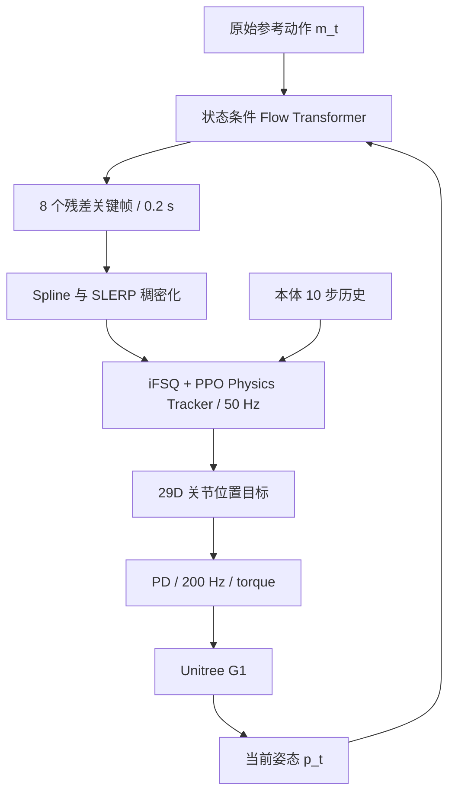

# Heracles 深度分析：从精确跟踪到生成式恢复

> 论文：**Heracles: Bridging Precise Tracking and Generative Synthesis for General Humanoid Control**  
> 作者：Zelin Tao et al.（X-Humanoid Team，共 16 位作者）  
> 版本：arXiv v2，2026-03-31  
> 核验日期：2026-08-06  
> 主要来源：[项目页](https://heracles-humanoid-control.github.io/) · [论文 HTML](https://arxiv.org/html/2603.27756v2) · [论文 PDF](https://arxiv.org/pdf/2603.27756v2)

本文区分三类表述：

- **论文事实**：论文、项目页或公开仓库明确给出。
- **分析判断**：根据方法与实验设计得出的评价。
- **经验估计**：论文或仓库未说明，依据同类 humanoid RL 项目估算。

最重要的证据边界是：截至核验日期，官方项目页仍标注 **“Code (Coming Soon)”**。因此，本文可以审查论文方法和公开结果，但不能验证其实现细节、训练可复现性、推理延迟或真机栈。

---

## 一、论文速览

### 1. 一句话总结

Heracles 在原始参考动作与低层 RL 跟踪器之间插入一个 **25 Hz、状态条件的 flow-matching 轨迹生成中间件**：正常时尽量透传参考，偏离参考时改写未来 0.2 s 的运动关键帧，再由 50 Hz 跟踪器和 200 Hz PD 环执行。

### 2. Elevator pitch

纯 motion tracker 在机器人远离参考轨迹后仍会强行追踪原动作，容易产生僵硬、短视甚至不可执行的纠偏；纯生成式控制又往往牺牲任务精度。Heracles 把两者分层：上层 flow-matching Transformer 根据当前机器人姿态与目标参考，生成 8 个短时域关键帧；下层 iFSQ 运动表征加 PPO tracker 将关键帧变成 29 维关节位置目标。论文在 101 条未见动作的 MuJoCo 测试中报告 90.6% completion rate，在 fall-and-recovery 子集上报告 90.0%，并在 Unitree G1 上展示跟踪和多方向起身。真正有价值的思想是：**状态偏离严重时，不应只加大追踪力度，而应先修改参考轨迹。**

### 3. 具体生态位

| 类别 | 匹配程度 | 原因 |
| --- | --- | --- |
| Motion tracking / imitation | **核心底座** | 下层以 PPO 学习通用参考动作跟踪。 |
| Whole-body control | **核心应用** | 29 DoF 全身关节、根部状态和全身 link tracking。 |
| Sim-to-real humanoid policy | **重要组成** | IsaacLab 训练、MuJoCo sim-to-sim、Unitree G1 真机展示。 |
| RL + generative/model-based hybrid | **最准确的分类** | 上层是离线 flow-matching 运动生成，下层是 RL physics tracker。 |
| Locomotion control | 次级 | 覆盖走跑，但目标比 locomotion 更广。 |
| Manipulation-aware control | 较弱 | 只展示少量 HOI，没有物体状态、接触目标或操作成功率建模。 |

### 4. 最核心的 3 个关键词

1. **State-conditioned reference rewriting**：根据实际状态改写参考。
2. **Residual flow matching**：在当前姿态锚定的残差空间生成短轨迹。
3. **Hierarchical frequency separation**：25 Hz 规划、50 Hz policy、200 Hz PD。

### 5. 最重要的 1 个贡献

提出了一个接口清晰的 **生成式参考调制层**。它不直接替换成熟的低层 tracker，而是把“任务意图”和“此刻物理上应该怎么动”分开，适合作为现有 humanoid tracking stack 的插件式研究方向。

### 6. 最值得怀疑的 1 个点

论文把恢复描述为对严重、分布外扰动的“生成式适应”，但训练数据明确包含 fall-and-recovery 动作；核心定量评估也主要是 **跟踪 fall-and-recovery 参考序列**，而不是在正常动作中施加随机强推后自主生成恢复并重新接回任务。因而，现有证据尚不能区分：

- 学会了“从新状态组合恢复动作”；还是
- 在显式恢复数据附近做条件插值。

### 7. 最值得优先精读的 3 个部分

1. **Sec. 3.2**：几何残差、flow matching、首帧 inpainting、directional warm start。
2. **Sec. 3.4**：训练对构造、noisy-state augmentation、Jacobian 加权。
3. **Sec. 4.2–4.4**：主结果、fall-and-recovery 结果以及消融，重点检查 claim 与证据是否对齐。

### 8. 是否值得纳入重点列表

**值得重点精读。** 它命中了 tracking 路线中非常真实的失效机制：状态远离 reference manifold 后，“更努力地追踪”本身可能就是错误目标。

### 9. 是否值得纳入复现列表

**有条件复现。** 优先做“中间件概念验证”，暂不追求论文级复现；官方代码、数据划分和真机栈尚未公开。

---

## 二、问题定义与研究动机

### 1. 具体解决的问题

论文解决的是：**在保持通用动作跟踪精度的同时，让 humanoid 在严重状态偏离、跌倒或不连续参考下生成多步、较自然的恢复轨迹。**

它不是传统意义上的自主 locomotion planner，也不是显式接触规划器，而是一个位于参考动作和 physics tracker 之间的短时域 reference governor。

### 2. 针对的痛点

| 痛点 | Heracles 的应对 | 判断 |
| --- | --- | --- |
| 大偏差下 tracker 短视、刚性纠偏 | 先生成 0.2 s 恢复关键帧，再跟踪 | 问题真实，设计合理 |
| 跟踪精度与动作自由度冲突 | 近 reference 时近似透传，远离时重写 | 直觉成立，但“恒等映射”未被直接约束或测量 |
| 单步 policy 缺少多步协调 | 8 个关键帧 + receding horizon | 有助于补偿迈步、摆臂等序列动作 |
| 显式 tracking/recovery 状态机复杂 | 连续状态条件生成 | 避免人工阈值，但不等于自动获得安全保证 |
| 多动作训练难度不均 | smoothed adaptive sampling | 是实用工程改进，创新性相对有限 |
| 真实状态与干净 MoCap 不一致 | 仅扰动起始状态的 asymmetric noise | 消融显示有效，但噪声范围未完整披露 |

### 3. 相比传统 imitation + RL 流水线的新意

传统路线通常是：

$$
\text{MoCap reference} \rightarrow \text{RL tracker} \rightarrow \text{PD target}.
$$

Heracles 改为：

$$
\text{MoCap reference} \rightarrow
\underbrace{\text{state-conditioned trajectory rewriting}}_{\text{flow matching}}
\rightarrow \text{RL tracker} \rightarrow \text{PD target}.
$$

关键变化不是换了 PPO，而是将 **reference 本身变成闭环可修改变量**。这等价于把可行性恢复的一部分从 action policy 提升到运动参考层处理。

### 4. 核心假设及合理性

1. **运动数据包含足够丰富的可行转移。** 这是强假设。训练集含专有 MoCap 和恢复动作，未公开覆盖范围。
2. **当前姿态与目标参考足以决定恢复方向。** 这是偏强假设。生成器的 38D/35D 状态只含关节位置、根位置和根姿态，未含根线速度、角速度、关节速度、接触状态；相同姿态但不同动量的恢复策略可能完全不同。
3. **低层 tracker 能执行生成器提出的关键帧。** 论文没有显式可跟踪性判别器、动力学约束或 safety shield；可行性主要来自数据先验和 tracker 的容错。
4. **短时域反复重规划能产生长时恢复。** 对起身等任务合理，但 0.2 s horizon 是否足以处理高速旋转、滑移和多接触转换，尚缺 horizon 消融。
5. **状态条件会自然形成“近处透传、远处生成”。** 论文没有 identity loss、显式门控或 reference rewrite magnitude 曲线，因此这是实验现象/设计意图，而非结构保证。

### 5. Benchmark 问题还是部署问题

**两者都有，但目前证据更接近“面向部署的问题 + 以自建 benchmark 验证”。**

- 部署导向：G1 真机、频率分层、35D 无外部定位版本、sim-to-sim。
- Benchmark 局限：101 条测试动作、恢复子集、数据划分和评估脚本均未公开；真实机器人没有系统成功率、扰动力量、跌倒率或硬件冲击统计。

---

## 三、方法总览：Input → Latent → Output

### 1. 输入

Heracles 实际有两个输入层级。

#### 生成式中间件（25 Hz）

- 当前机器人配置：
  - 38D：29 维关节位置 + 3D 根位置 + 6D 根姿态；或
  - 35D：去掉 3D 根位置，依靠关节编码器和 IMU。
- 当前原始参考命令/目标姿态 $\mathbf m_t$。
- flow timestep。

**没有明确输入**：根线速度、根角速度、关节速度、接触状态、力、地形几何、物体状态或视觉。

#### 低层 physics tracker（50 Hz）

本体状态：

$$
\mathbf p_t =
[\mathbf g_t^{\mathrm{proj}},\boldsymbol\omega_t,
\mathbf q_t-\mathbf q_0,\dot{\mathbf q}_t,\mathbf a_{t-1}],
$$

以及 10 步本体历史、10 帧未来运动窗口编码得到的离散 motion token $\mathbf z_d$。参考量包含根线/角速度、根姿态误差和目标关节位置。

> 注意：论文对 $\mathbf p_t$ 有符号复用。系统公式中的“proprioceptive state”和生成器实际使用的 38D/35D pose state 并不相同，这会给复现带来歧义。

### 2. 中间表示

#### A. 生成器残差轨迹

以当前姿态复制成静态 baseline：

$$
\boldsymbol\beta_{t,k}=\mathbf p_t,
\qquad k=0,\ldots,K-1,
$$

预测相对残差 $\mathbf r_t$：

$$
\boldsymbol\tau_t=\boldsymbol\beta_t+\mathbf r_t,
\qquad \boldsymbol\tau_t\in\mathbb R^{K\times D}.
$$

其中 $K=8$、$D\in\{38,35\}$、horizon 为 0.2 s。

#### B. Flow-matching latent

真实残差 $\mathbf x_0$ 与噪声 $\mathbf x_1\sim\mathcal N(0,I)$ 线性插值：

$$
\mathbf x_s=(1-s)\mathbf x_0+s\mathbf x_1,
\qquad s\in[0,1].
$$

AdaLN Transformer 预测速度场。

#### C. Tracker 的离散 motion token

未来 10 帧参考经 encoder 得到连续 latent，再由 improved Finite Scalar Quantization（iFSQ）逐维量化成 $\mathbf z_d$。重建头确保 token 保留运动信息，action decoder 将 token 与 10 步本体历史融合。

### 3. 输出

- **中间件输出**：8 个机器人配置空间关键帧，而不是 torque 或 PD action。
- **tracker 输出**：29 维关节位置目标 $\mathbf a_t$。
- **驱动层输出**：200 Hz PD 根据关节位置目标产生 torque。

### 4. 最关键的设计点

1. **残差参数化**：避免网络把大量容量浪费在复制当前/参考姿态上。
2. **首帧 inpainting**：固定第一 token 为零残差锚，减轻轨迹起点跳变。
3. **Directional warm start**：从“当前状态线性走向目标”的带噪先验开始，只用 5 个 Euler 步。
4. **闭环 receding horizon**：每 0.04 s 重算，而非一次性生成完整恢复动作。
5. **生成与执行解耦**：生成器只改写 kinematic reference，tracker 负责动态可执行性。

### 5. 信息流框图

---

## 四、动作表示（Action Representation）重点分析

### 1. 到底是什么动作表示

必须区分两层：

| 层级 | 表示 | 本质 |
| --- | --- | --- |
| Generative middleware | 8 × 35/38D 的短时域配置关键帧残差 | **robot-space motion chunk / reference action** |
| Physics tracker | 29D 关节位置 target | **low-level PD target** |
| 执行器 | PD 计算的 torque | 非策略直接输出 |

因此，Heracles 的创新 action representation 不是 torque，也不是 latent skill token，而是：**上层生成机器人配置空间的短轨迹，下层仍使用传统关节位置目标。**

### 2. 为什么适合人形机器人

- 关键帧能表达需要多步协调的补偿迈步、摆臂、躯干回正。
- 配置空间与 MoCap/retargeted motion 数据天然对齐，便于监督学习。
- 与 tracker 解耦，可复用现有 sim-to-real 低层策略。
- 位置目标 + PD 对商用 humanoid 接口友好，比直接 torque 更容易落地。

### 3. 与常见表示对比

| 表示 | 优点 | 缺点 | 与 Heracles 的关系 |
| --- | --- | --- | --- |
| PD target | 稳定、接口普遍、易 sim2real | 强依赖增益与关节标定，接触力不可直接控制 | Heracles 的最终 action |
| Torque | 可直接优化接触动力学和柔顺性 | 训练难、模型误差敏感、硬件风险高 | 未采用 |
| End-effector action | 任务语义直接、适合操作 | 需 IK/WBC，可能忽略全身自然度 | 未采用 |
| 单帧 motion imitation target | 简单、高频反馈 | 大偏差下短视，没有恢复规划 | Heracles 要解决的 baseline |
| Latent skill | 压缩、多模态、可组合 | 可解释性和精确跟踪较弱 | iFSQ token 属于 tracker 内部 latent |
| Motion chunk | 多步一致性、适合恢复 | 延迟更高，存在 planning-control gap | Heracles 中间件的核心表示 |

### 4. 对系统属性的影响

| 属性 | 影响 |
| --- | --- |
| 控制稳定性 | PD target 和 50/200 Hz 分层有利；但中间件可能改写出 tracker 未见的轨迹。 |
| 样本效率 | 离线 flow 训练比端到端 RL 学恢复更容易；tracker 本身仍需大规模 PPO。 |
| Sim2real | kinematic middleware 较少依赖精确动力学；真正 sim2real 负担转移到 tracker 和 PD。 |
| 接触鲁棒性 | 多帧轨迹有利于协调恢复；但没有接触/力条件，不能称为显式接触控制。 |
| 动作自然度 | 运动数据先验有优势；但“自然”主要是视频定性判断，无人类偏好或 motion-quality 指标。 |
| 高频闭环 | 生成器只跑 25 Hz，避免塞入 200 Hz torque loop；仍需证明最坏时延和 deadline miss。 |

### 5. 硬件依赖

- 29 DoF action、G1 关节顺序、限位、PD gain、action scaling 与 robot asset 强耦合。
- 35D 生成器可去掉外部定位，但无法纠正全局平移漂移。
- 38D 版本需要可靠根位置，论文没有披露真机定位方案、延迟或漂移。
- 论文没有报告 actuator delay randomization、motor model、torque saturation 处理和安全过滤器。

### 6. 是否是复现最大难点

**是关键难点之一，但不是最难的。** 位置 target 本身容易复现；困难在于确保：

1. 生成关键帧、插值后 reference feature、tracker observation 完全一致；
2. 根坐标系、Rot6D、速度差分和关节顺序无误；
3. PD gain、action scale 与 simulator/真机严格对齐；
4. reference rewrite 不制造不连续速度或瞬时接触切换。

### 小结

**Heracles 的 action representation 本质上是“生成式配置空间 motion chunk + 低层 joint-position PD target”的分层表示。它重要，是因为把多步恢复规划与高频物理执行解耦；它的局限，是物理可行性没有在生成表示中被显式保证。**

---

## 五、策略架构与技术实现

### 1. 架构

#### 生成式中间件

- 6 个 attention block
- 4 heads
- hidden dimension 512
- 22.9M 参数
- AdaLN 注入 $[\mathbf p_t,\mathbf m_t]$ 与 flow timestep
- 5 步 Euler ODE integration
- 每次生成 8 个关键帧、覆盖 0.2 s

#### Physics tracker

- Motion encoder：10 帧未来参考 $\mathbf M_{t:t+9}$ → continuous latent。
- iFSQ quantizer：逐维离散化。
- Reconstruction decoder：重建 10 帧参考。
- Action decoder：$\mathbf z_d$ + 10 步 proprioceptive history → 29D action。
- PPO asymmetric actor-critic，encoder、reconstruction head、action head 联合训练。

论文没有完整给出 iFSQ latent dimension、量化位数、各 encoder/decoder 层宽、激活函数、归一化和 loss 权重；没有代码时无法精确重建。

### 2. 为什么采用这种架构

- Transformer 适合对 8-token 短轨迹建模并表达多模态恢复。
- AdaLN 让状态、目标和 diffusion time 深度调制各层，而非只在输入拼接。
- iFSQ 避免 VQ-VAE codebook lookup/collapse，并提供有限离散 motion representation。
- 双头设计让 token 同时服务于“表示运动”和“生成动作”。

### 3. 相对传统 MLP policy 的优势

优势不主要来自“Transformer 比 MLP 强”，而来自层级结构和多步输出。事实上，论文中的普通 Transformer baseline 的 CR 只有 80.6%，低于 MLP 的 84.8%。这说明：

- 仅替换网络骨干并不会自动提升控制；
- 残差轨迹、训练数据构造、noise augmentation 和 kinematic weighting 更关键。

### 4. 优势是否被实验证明

| Claim | 证据强度 | 说明 |
| --- | --- | --- |
| Full Heracles 提高 CR | 中—强 | 同一 101-sequence set 上从 iFSQ 的 87.2% 到 90.6%。 |
| Fall/recovery 显著受益 | 强（仿真内部） | 90.0% vs iFSQ 48.2%；但任务本身含恢复参考。 |
| iFSQ 优于 VQ-VAE | 中 | joint error 显著更低，但 CR 略低；未比较连续 latent。 |
| Transformer 架构本身更好 | 不支持 | 普通 Transformer baseline 反而更差。 |
| 自然、类人恢复 | 弱—中 | 主要为视频定性，无定量 naturalness 指标。 |
| 开放式 compositional generalization | 弱 | 无系统的 held-out primitive/composition protocol。 |

### 5. 时序建模

- Generator 输出 0.2 s 多帧窗口，并通过 25 Hz 重规划形成长时闭环。
- Tracker action decoder使用 10 步 proprioceptive history。
- Motion encoder读取 10 帧 future reference。
- 但 generator 的 current-state condition 没有速度和历史，无法直接辨识动量方向。

### 6. 分层控制

是，且有三层：

1. 25 Hz 生成式参考调制；
2. 50 Hz RL tracking；
3. 200 Hz joint PD。

### 7. 接触、相位与环境条件

- 相位：未来 reference window 和 iFSQ token 隐式提供。
- 接触：只在 reward 中惩罚 undesired contacts；policy 不输入接触。
- 环境：平地，无高度图、点云、SDF 或视觉。

### 8. 架构取舍

**偏强表达能力和模块化，其次是实时性；泛化与部署性尚未充分证明。** 25 Hz/5-step 设计显然考虑了实时性，但论文没有生成器 latency、部署算力或 deadline 统计。

---

## 六、接触、力与物理一致性

### 1. 是否显式估计接触力或接触状态

**没有。** Observation 中没有 foot contact、force/torque sensor、估计 wrench 或 CoP。

### 2. 它如何“理解力”

- Generator：仅从运动数据学习姿态转移统计，不接触物理仿真，也不读取力。
- Tracker：通过 PPO rollout、摩擦/CoM randomization、外部 push 和接触惩罚，隐式学习动力学反馈。
- PD：负责将位置 target 转成力矩，但策略不直接控制或估计接触力。

### 3. 是否真的建模 contact physics

**不是显式 contact model。** 更准确地说，Heracles 是：

> kinematic generative prior 提议 reference，RL tracker 用仿真经验把它投影到可执行行为附近。

生成器没有接触时序、摩擦锥、ZMP/CMP、centroidal momentum、support polygon 或 torque limit 约束，因此“dynamically feasible trajectory”是经验性结果，不是优化约束保证。

### 4. Reward 与物理目标

正向 tracking reward 使用：

$$
r_i=w_i\exp\left(-\frac{\lVert e_i\rVert^2}{\sigma_i^2}\right).
$$

| 跟踪量 | $w_i$ | $\sigma_i$ | 物理意义 |
| --- | ---: | ---: | --- |
| Root position | 0.1 | 0.30 | 全局/根位置精度，权重较低 |
| Root orientation | 0.5 | 0.40 | 躯干姿态和平衡 |
| Root linear velocity | 1.0 | 0.50 | 平移动态 |
| Root angular velocity | 1.0 | 1.00 | 旋转动态 |
| Relative body position | 1.0 | 0.30 | 全身几何姿态 |
| Relative body orientation | 1.0 | 0.40 | link 朝向 |
| Body linear velocity | 1.0 | 1.00 | 全身动态一致性 |
| Body angular velocity | 1.0 | $\sqrt\pi$ | link 旋转动态 |

Regularization：

$$
r_{\mathrm{reg}}=
-0.1\lVert a_t-a_{t-1}\rVert^2
-10\sum\max(0,q-q_{\mathrm{lim}})
-0.1\sum\mathbb 1(F_c>1).
$$

对应关系：

| 目标 | 是否直接覆盖 |
| --- | --- |
| 稳定/平衡 | 间接：root/body 姿态、速度与 episode termination |
| 足底接触时序 | 否 |
| 防滑 | 否；仅通过摩擦 randomization 间接学习 |
| 能耗/torque | 否 |
| 动作跟踪 | 是，且是 reward 主体 |
| 碰撞 | 有 undesired contact penalty，但定义和 body mask 未完全披露 |

### 5. 三类目标函数

#### A. Flow velocity matching

$$
\mathcal L_{\mathrm{vel}}=
\mathbb E\left[
\left\|
\hat{\mathbf v}(\mathbf x_s,s,\mathbf c_t)
-(\mathbf x_1-\mathbf x_0)
\right\|_2^2
\right].
$$

作用：学习从噪声分布逆向流向真实 residual trajectory distribution。它建模多模态轨迹，但本身不保证动力学可行或接触安全。

#### B. Kinematics-aware weighting

$$
w_d(\mathbf q)=
\sum_b\left\|\frac{\partial \mathbf p_b}{\partial q_d}\right\|_2^2
\approx \operatorname{diag}(J^\top J)_d.
$$

作用：同样大小的关节误差，对末端 Cartesian displacement 影响不同；长力臂关节得到更大权重。它是很实用的几何 inductive bias，但仍不是动力学或接触权重。

#### C. iFSQ reconstruction

$$
\mathcal L_{\mathrm{rec}}=
\frac1{10}\sum_{k=0}^9
\left\|\hat{\mathbf m}_{t+k}-\mathbf m_{t+k}\right\|_2^2.
$$

作用：避免 token 只服务 RL action 而丢失运动语义。它与 PPO 共同训练，具体权重未披露。

### 6. 接触控制强弱判断

**不是强接触控制论文。** 它的强项是“接触失稳后的参考轨迹重写”；不是显式力控、接触规划或柔顺控制。对 System0 视角而言，Heracles 更适合作为 intent/reference adaptation 层，而不能代替高频接触状态估计、安全约束、wrench/impedance 控制。

---

## 七、训练数据与训练策略（复现视角）

### 1. 主要依赖什么数据

| 数据 | 用途 |
| --- | --- |
| LAFAN1 | 长序列 locomotion、dance、fall/get-up 等 |
| 100STYLE | 风格化 locomotion |
| SnapMoGen | 多样生成/动作片段来源 |
| AMASS | 大规模人体 MoCap |
| Proprietary in-house MoCap | 补充动态、恢复或专有动作；规模未披露 |
| IsaacLab rollout | PPO tracker 的交互数据 |

没有报告使用真实机器人数据训练；“in-house motion capture”是人体运动资产，不等同于真机 interaction data。

### 2. 数据集各自作用和缺口

公开来源提供多样运动先验，专有数据很可能影响极端恢复动作覆盖。论文未给出：总小时数/帧数、每个来源占比、retargeting 工具与参数、清洗规则、训练/测试 clip ID、是否人物或序列级去重、恢复动作数量。因此无法排除近重复和数据泄漏，也无法重建 101-sequence benchmark。

### 3. 训练阶段

1. 人体动作 → G1 29 DoF 重定向与特征生成；具体 pipeline 未披露。
2. 在 IsaacLab 中以 PPO 训练 iFSQ general tracker。
3. 初期 uniform sampling，之后启用 smoothed difficulty curriculum。
4. 从动作库离线构造短轨迹/远目标训练对。
5. 加 asymmetric noisy-start augmentation 和 Jacobian loss weights。
6. 训练 flow-matching generator。
7. 部署时将 generator 插到 tracker 的 reference buffer 前。

这不是 teacher-student distillation；生成器也没有通过真实 physics rollout 进行 fine-tuning。

### 4. Curriculum

每个 motion temporal bin 维护 difficulty：

$$
F_b\leftarrow \alpha d_b+(1-\alpha)F_b,
$$

对难度做邻域卷积、异常值截断，并与 uniform sampling 混合：

$$
P_b=\eta\tilde F_b+\frac{1-\eta}{B}.
$$

优点是防止简单 locomotion 支配训练，并避免单个失败 bin 过采样。缺点是 $\alpha,c,\eta$、kernel、warm-up 长度和 bin size 均未完整给出。

### 5. Sim2real 路线

- IsaacLab 训练、MuJoCo 评估，形成 sim-to-sim check。
- friction、CoM、command target 和 push randomization。
- generator 使用 noisy-state augmentation。
- 50 Hz policy + 200 Hz PD。
- 35D 版本试图避免外部全局定位。

未明确披露：actuator network、action latency randomization、motor strength、payload、link mass/inertia、battery voltage、encoder bias、IMU delay、通信 jitter、system identification 或 real-to-sim 校准。论文将 domain randomization 称为“comprehensive”略显过强。

### 6. 训练资源

**论文事实：**

- 1 × NVIDIA A100 80 GB
- 16,384 并行环境
- physics 200 Hz，policy 50 Hz
- PPO rollout horizon 24
- 约 100,000 iterations
- generator batch 256、4,000 epochs、22.9M 参数

论文没有报告 wall-clock 时间。若 iteration 指一次完整 PPO rollout，则数据量约为：

$$
16{,}384\times24\times100{,}000
=3.93\times10^{10}
$$

个 policy transitions，规模很大；缺少代码时不能确认“iteration”的精确定义或是否存在阶段训练/早停。

### 7. 最关键的 3 个工程点

1. **坐标系和 reference buffer 一致性**：root frame、world frame、yaw removal、Rot6D、速度差分、Spline/SLERP。
2. **先得到强 tracker**：generator 不能拯救一个 tracking manifold 很窄或 sim2real 很差的底座。
3. **训练对构造**：如何从同一运动序列采样 start/end、控制 gap 分布、生成 0.2 s target，是恢复泛化的核心。

---

## 八、实验评估：结果是否真的站得住

### 1. 实验组成

1. IsaacLab 训练、MuJoCo sim-to-sim。
2. 101 条未见动作，最长 20 s，覆盖 locomotion、dance、martial arts、daily activity、fall/recovery。
3. MLP、Transformer、VQ-VAE、SONIC 及 3 个 iFSQ 变体。
4. fall-and-recovery 子集及 piecewise-constant 参考。
5. Unitree G1 真机动作跟踪与三种初始倒地姿态的起身展示。
6. generator 的 warm start、noise augmentation、kinematic weighting 消融。

### 2. 指标及含义

- **CR**：满足 root height error < 0.3 m 且 root orientation error < 1.2 rad 的参考帧比例。
- Joint position error：关节角 $L_2$ 偏差。
- Root height error：竖直跟踪。
- Root orientation error：去除 yaw 的姿态误差。
- Root linear velocity error：body frame 根速度误差。

CR 的阈值较宽：1.2 rad 约等于 68.8°，且 CR 是“合格帧比例”，并非严格意义的 episode success/completion，也不约束 root XY 漂移。将其直接解释成“任务成功率”需要谨慎。

### 3. 主结果

| Method | CR ↑ | Joint err ↓ | Height err ↓ | Ori err ↓ | LinVel err ↓ |
| --- | ---: | ---: | ---: | ---: | ---: |
| MLP | 84.8% | **1.1572** | 0.1194 | 0.3590 | 0.2230 |
| Transformer | 80.6% | 1.5436 | 0.1426 | 0.3410 | 0.2046 |
| VQ-VAE | 86.0% | 2.3013 | 0.1077 | 0.3675 | 0.2376 |
| SONIC | 79.3% | 1.9828 | 0.1402 | 0.3771 | 0.2334 |
| iFSQ-BM | 85.1% | 1.4760 | 0.1096 | 0.3474 | 0.2362 |
| iFSQ+H | 87.3% | 1.2924 | **0.0271** | **0.1539** | 0.1709 |
| iFSQ | 87.2% | 1.1863 | 0.0955 | 0.3614 | **0.1561** |
| **Heracles** | **90.6%** | 1.3272 | 0.0764 | 0.2728 | 0.2325 |

#### 正确解读

- Heracles 最强的是 **survival/completion robustness**。
- 它不是所有 tracking accuracy 指标最优：MLP joint error 更低，iFSQ velocity error 更低，iFSQ+H height/orientation 更低。
- 相比 standalone iFSQ，Heracles CR 提高 3.4 个百分点，但 joint error 从 1.1863 变差到 1.3272，velocity error 从 0.1561 变差到 0.2325。
- 这恰好说明方法确实在做 trade-off：牺牲局部严格跟踪，换取不跌倒和更好的根姿态恢复。

### 4. Fall-and-recovery 结果

| Method | CR ↑ | Joint err ↓ | Height err ↓ | Ori err ↓ | LinVel err ↓ |
| --- | ---: | ---: | ---: | ---: | ---: |
| MLP | 44.0% | 2.1720 | 0.3586 | 1.0157 | 0.2710 |
| VQ-VAE | 69.8% | 2.5700 | 0.1898 | 0.4307 | 0.2719 |
| iFSQ | 48.2% | 2.0236 | 0.3024 | 1.0488 | **0.2405** |
| **Heracles** | **90.0%** | **1.4114** | 0.0762 | **0.2427** | 0.2830 |

该结果对“中间件帮助极端姿态转移”很有说服力，但不能单独证明“遇到未见强扰动后自主恢复”：评测引用本身就是 fall/recovery motion，训练库也包含此类序列。

### 5. 真机证据

论文展示 walk、run、kick、360° kick、HOI 和多方向起身。对三种初始倒地配置各报告一次成功，共三次试验。未报告：

- 统一任务成功率与重复次数；
- push magnitude、impulse、方向和时间；
- 跌倒率、恢复时间、最大 torque/接触冲击；
- 与 baseline 的同机对照；
- generator 推理 latency 和 missed deadline；
- 长时间连续运行与温度/电量变化。

因此真机结果证明“能运行并有代表性成功案例”，尚不足以证明工业级鲁棒性。

### 6. 泛化判断

| 能力 | 是否被证明 | 判断 |
| --- | --- | --- |
| 动作泛化 | 部分 | 101 条 held-out motion，但 split 未公开。 |
| 空间/环境泛化 | 否 | 仅平地，无地形或障碍条件。 |
| 指令泛化 | 弱 | 目标仍是 motion reference，不是文本/任务指令。 |
| 强扰动恢复 | 部分 | 视频和恢复动作评估有证据，缺标准化 push sweep。 |
| Sim2real | 定性成立 | G1 成功演示，但没有统计和 latency 细节。 |
| Compositional recovery | 未充分证明 | 没有 leave-one-transition-out 或组合泛化 benchmark。 |

如果成功率在动作类别之间波动很大，通常意味着 motion corpus 覆盖不均、retargeting 质量差异、curriculum 未平衡难动作，或 tracker/generator 在某些接触拓扑上超出分布。论文只给聚合结果，没有逐类别样本数、均值、方差和失败分布，因此无法判断 90.6% 是否由大量简单 locomotion 帧主导。

### 7. Benchmark 是否偏友好

可能存在以下偏友好因素：

1. 自建 motion corpus、自建 split，未开放。
2. CR 阈值宽且是逐帧比例。
3. 主表聚合不同动作类别，未给 category-wise 分布、方差和置信区间。
4. piecewise-constant 参考结果没有单独完整报告。
5. SONIC 虽来自官方 release，但其 observation/data/scale 优势可能无法在相同预算下公平体现。
6. 没有与显式 recovery policy、state machine、MPC/reference governor 或 deterministic trajectory predictor 对比。

### 8. 性能冲榜还是方法可信度

**概念与内部消融较强，外部可验证性偏弱。** 论文不是单纯冲某个公开 leaderboard；它提出了有价值的系统结构。但 benchmark、代码、数据、真实统计均未开放，使方法可信度目前高度依赖作者报告。

---

## 九、推理频率、实时性与部署成本

### 1. 频率

| 环节 | 频率 |
| --- | ---: |
| Physics simulation / PD | 200 Hz |
| RL tracker | 50 Hz |
| Flow middleware replanning | 25 Hz |
| 每次 generator horizon | 0.2 s |
| ODE solver | 5 Euler steps / replan |

### 2. 推理延迟

**论文未报告。** 只给出了网络规模、ODE 步数和频率。25 Hz 要求整个生成、插值、buffer 更新和同步最好稳定低于 40 ms，并保留 safety margin；平均 latency 低于 40 ms 也不等于满足实时 deadline。

### 3. 是否适合闭环控制

结构上适合：它每 40 ms 用最新状态重规划，下层持续以 50/200 Hz 闭环执行。风险是 generator condition 缺速度、接触和地形信息，且没有 runtime feasibility/safety check。

### 4. 算力需求

- Tracker：论文未报告真机推理硬件和 latency；iFSQ 编解码预计可做板载推理，但不能据此断言 CPU 足够。
- Generator：22.9M Transformer × 5 Euler steps × 25 Hz，较可能需要板载 GPU 或外接 GPU 才有充足 margin；这是**经验估计**。
- 训练：对齐论文需 A100 80 GB 级 GPU；消费卡可缩小并行环境，但训练时长显著增加。

### 5. 硬件侧难点

1. 38D 版本的 root position estimation。
2. 生成器与 tracker 的异步 buffer、时间戳和 reference phase。
3. Cubic spline 对关节限位、速度和加速度的 overshoot。
4. PD gain、torque saturation、关节热限制和碰撞安全。
5. IMU/encoder 同步以及突然接触后的状态估计失真。
6. 生成器 stochasticity 导致真机行为不确定。
7. 跌倒状态下 cable、关节自碰、地面接触和手臂支撑风险。

### 6. 如何避免“大模型太慢”

- 只在 25 Hz 跑生成器。
- 只生成 8 个关键帧。
- directional warm start 后只做 5 个 Euler step。
- 高频执行交给较小 tracker 和 PD。

### 7. 是否依赖两层控制与兜底

明确依赖低频生成 + 高频 tracker + 更高频 PD。没有披露 MPC、安全 QP、CBF 或显式 fall detector 兜底。

### 8. 闭环部署难度判断

**高。** 不是因为 22.9M 参数本身特别大，而是恢复场景要求同时保证低延迟状态估计、reference continuity、动作可行性、碰撞安全和极端姿态下的真机保护；官方部署代码与 latency 尚未公开。

---

## 十、消融实验与关键模块判断

### 1. 已做消融

| Variant | CR | 相对 full 变化 | 判断 |
| --- | ---: | ---: | --- |
| Full | 90.6% | — | — |
| 无 directional warm start | 87.2% | -3.4 pt | 有效，但影响最小 |
| 无 noisy-state augmentation | 78.6% | -12.0 pt | 最关键 |
| 无 kinematics-aware weighting | 82.1% | -8.5 pt | 次关键 |

### 2. 哪个模块最关键

按现有 CR 消融，**asymmetric noisy-state augmentation** 最关键。它说明真正难点不是 flow matching 的形式，而是训练状态与闭环执行状态之间的分布差。

### 3. 消融是否充分

对三个工程模块的因果性有一定支持，但对论文最核心 claim 不充分。缺失的关键消融包括：

1. Flow matching vs deterministic MLP/Transformer regression。
2. State-conditioned vs reference-only generator。
3. 明确 identity bypass 或显式 tracking/recovery switch baseline。
4. 不含 recovery motions 的 generator，检验恢复是否真正 emergent。
5. Leave-one-recovery-direction/type-out 泛化。
6. 1/3/5/10 ODE steps 与 latency/性能曲线。
7. 0.1/0.2/0.4 s horizon 与 10/25/50 Hz replanning。
8. 35D vs 38D 的完整定量表；论文只称两者恢复和 tracking 等效。
9. 加入速度、接触或力条件的价值。
10. 多随机种子、不同采样 seed 的结果方差。
11. Rewrite magnitude 随 state-reference error 的曲线，以验证“近处恒等、远处生成”。

### 4. 如果只能保留一个创新点

保留 **state-conditioned reference rewriting middleware**。iFSQ、adaptive sampling、noise augmentation 和 Jacobian weighting 都可被其他实现替换；中间层接口才是论文最具迁移价值的思想。

---

## 十一、局限性、失败模式与潜在水分

### 1. 最大局限

**生成器声称在做物理恢复规划，却只观察姿态，不观察速度、接触和环境。** 对恢复而言，动量往往与姿态同等重要；同一姿态处于向前跌、向后反弹或静止时，正确动作不同。低层 tracker 可以局部补偿，但上层规划器存在部分可观测性。

### 2. 可能强于证据的结论

1. **“Identity map”**：残差参数化有利于学习近似恒等，但没有约束或定量验证。
2. **“Dynamically feasible”**：generator 在 kinematic data 上训练，没有物理约束或 rollout validation。
3. **“Emergent recovery”**：训练数据明确含 fall-and-recovery motions。
4. **“Extreme OOD perturbations”**：定量主证据是 held-out motion tracking，不是标准化真实 push benchmark。
5. **“Open-ended/general-purpose”**：无视觉、几何、接触、物体 dynamics 或语义任务输入，仅在 motion manifold 上重规划。

### 3. 关键缺失实验

- 正常走/跑中随机时间、方向、强度的推扰 sweep。
- 与显式 recovery policy/state machine 的相同预算比较。
- 无 recovery data 训练后对 recovery 的测试。
- 真实机器人至少数十次/条件的成功率与置信区间。
- 不同地面摩擦、坡度、柔软地面、负载和 actuator degradation。
- 生成器 latency、功耗、deadline miss 和连续运行。
- 接触冲击、峰值 torque、能耗与硬件安全指标。

### 4. 依赖性

| 依赖 | 程度 | 说明 |
| --- | --- | --- |
| 特定硬件 | 中—高 | G1 29 DoF、PD 和资产强耦合。 |
| Reward engineering | 中 | tracker reward 项不多，但权重、termination、DR 仍关键。 |
| Reference quality | 高 | generator 和 tracker 都以重定向动作作为核心监督。 |
| Simulator fidelity | 高 | 无 actuator adaptation 或 real-data correction。 |
| 受控环境 | 高 | 平地、无视觉/地形输入。 |

特别值得核验的是论文表中的 CoM offset：x 方向 $\pm0.5$ m 对 1.32 m、35 kg 的 G1 非常激进，可能是特殊实现、坐标定义或排版问题；没有代码无法确认。

### 5. 组会上最值得问的 5 个问题

1. **Generator 不看速度和接触，如何区分相同姿态下不同动量/支撑状态？**
2. **恢复数据已在训练集中，为什么称恢复为 emergent 或 OOD？能否做 no-recovery-data 与 leave-one-mode-out？**
3. **“近参考时 identity、远参考时 rewrite”有无直接曲线、阈值统计或 reference distortion 指标？**
4. **真实机器人的标准化 push success rate、恢复时间、峰值接触力和 baseline 是什么？**
5. **生成轨迹没有动力学/接触约束时，如何检测并阻止 infeasible 或 unsafe reference 被写入 tracker buffer？**

---

## 十二、与 BeyondMimic 对比

来源：[BeyondMimic 项目页](https://beyondmimic.github.io/) · [论文](https://arxiv.org/html/2508.08241v1) · [官方 motion-tracking 仓库](https://github.com/HybridRobotics/whole_body_tracking)

| 对比维度 | Heracles | BeyondMimic | 分析 |
| --- | --- | --- | --- |
| 研究目标 | 精确跟踪 + 状态偏离后的生成式恢复 | 高质量 sim2real tracking + test-time task guidance | Heracles 聚焦“失稳时改参考”；BeyondMimic 聚焦“用代价函数组合技能完成任务”。 |
| 方法类别 | Kinematic flow middleware + RL tracker | RL trackers → offline state-action co-diffusion | Heracles 生成 reference；BeyondMimic diffusion 直接生成 state-action trajectory。 |
| 输入观测 | 当前 pose、原始 reference；tracker 有 10 步历史 | Diffusion 有 4 步 state-action history；tracking policy 为单步 observation | BeyondMimic diffusion 状态更包含动力学历史。 |
| 动作表示 | 上层 8 个配置关键帧；下层 29D joint targets | 联合 state-action trajectory；tracker action 为 normalized joint setpoint | Heracles 的中间件更易插到任意 tracker；BeyondMimic action 更直接但耦合更深。 |
| 策略架构 | 22.9M AdaLN flow Transformer + iFSQ encoder-decoder tracker | 19.95M DDPM Transformer decoder + MLP tracker/expert | 两者都分层，但 diffusion 所处层级不同。 |
| 是否依赖参考动作 | 是，始终以目标 reference 为条件 | Tracker 依赖；distilled diffusion 执行下游任务时不需要逐帧 reference | BeyondMimic 更接近 reference-free task policy。 |
| 是否强调 tracking | 是 | 是，且 tracker pipeline 是主要开源部分 | BeyondMimic 的 tracking 落地证据和代码更完整。 |
| 是否强调鲁棒 locomotion | 通过 recovery 强调 | 通过强 motion tracker 与 guided tasks 强调 | 侧重点不同。 |
| 是否支持复杂接触 | 起身、kick、少量 HOI；无接触条件 | 起身、cartwheel、obstacle avoidance；仍非显式 force control | 两者都不能等同于接触动力学控制。 |
| 生成机制 | Conditional flow matching，5 Euler steps | DDPM，20 denoise steps + cost gradient guidance | Heracles 更轻；BeyondMimic 更可任务化。 |
| 下游可控性 | 目标来自原 reference，无通用 cost guidance | waypoint、joystick、SDF obstacle costs | BeyondMimic 更强。 |
| 恢复机制 | 当前 state 直接改写未来 reference | state-action prior 可表示恢复，但论文重点是 guidance task | Heracles 更专门。 |
| Sim2real 路线 | DR + noisy state + hierarchy | 低阻抗、简洁 DR、action-delay DR、500 Hz estimator | BeyondMimic 的工程披露更具体。 |
| 真机验证 | G1 tracking + 三类倒地起身 | G1 大量 tracking、导航、遥控、避障 | BeyondMimic 的任务广度和运行细节更完整。 |
| 控制频率/实时性 | Generator 25 Hz、tracker 50 Hz、PD 200 Hz；latency 未报 | Tracker CPU <1 ms；diffusion RTX 4060 Mobile 约 20 ms、异步 offboard | BeyondMimic 有实测 latency，但 diffusion 外接 GPU 成本高。 |
| 部署成本 | 未知，推测需 GPU；无代码 | Tracker 可 CPU onboard；guided diffusion 需外部 4060 级 GPU | 当前 BeyondMimic 更可落地。 |
| 开源状态 | **未开源，Coming Soon** | Tracking 训练与部署仓库公开；guided diffusion 不完全公开 | Heracles 复现风险显著更高。 |
| 主要优点 | 模块化、恢复逻辑自然、低 ODE step、易与 tracker 解耦 | 完整任务闭环、可 differentiable cost guidance、真实工程信息充分 | 分别适合 recovery middleware 与 task synthesis。 |
| 主要缺点 | 状态缺速度/接触，物理可行性无保证，真机统计少 | 20-step guidance 延迟大、外接 GPU、cost engineering，完整 diffusion 代码缺失 | 都有 planning/control 或实时性权衡。 |

### 1. 研究哲学最大的不同

- **Heracles**：意图不变，但当前 reference 可能物理上不合适；应先生成一条回到意图流形的可执行过渡。
- **BeyondMimic**：先把多个 expert 的 state-action distribution 学成统一生成策略，再在采样时用任务 cost 将其“拉向”目标。

前者是 **reference repair**，后者是 **behavior synthesis and guidance**。

### 2. 动作表示与接口意味着什么

Heracles 不直接生成 action，因此更容易替换 low-level tracker，也更容易把生成层与安全控制器隔离；代价是 generator 的“可行”必须由 tracker 兜底。BeyondMimic 联合生成 state/action，减少 planning-control gap，并可直接对 predicted state 求任务 cost；代价是对 action convention、延迟和硬件更敏感。

### 3. 哪个更像论文方法，哪个更容易落地

- **当前状态下**：Heracles 更像值得研究的架构命题；BeyondMimic 的 tracking 部分更容易落地。
- 若只比较生成部分：Heracles 的 5-step/25 Hz 设计可能更轻，但因为没有代码和 latency，不能据此判定实际部署更简单。

### 4. 后续研究借鉴建议

1. 借鉴 Heracles 的 **state-conditioned reference rewriting + receding horizon**。
2. 借鉴 BeyondMimic 的 **低阻抗 action scaling、state-action dataset、延迟 randomization 和明确部署 profiling**。
3. 将两者结合：生成器输出 reference proposal，同时学习可跟踪性/安全 score；必要时由 state-action model 或约束优化器做 projection。

---

## 十三、主动搜索并评估开源代码仓库

### 1. 候选仓库

| 仓库 | 类型 | 与论文关系 | 完整度 | 可信度 | 备注 |
| --- | --- | --- | --- | --- | --- |
| [Heracles 项目页](https://heracles-humanoid-control.github.io/) | 官方页面，非代码仓库 | 直接对应 | **低** | **高** | 明确写着 Code Coming Soon。 |
| [Open-X-Humanoid](https://github.com/Open-X-Humanoid) | 官方机构 GitHub org | 作者机构相关 | **低（对 Heracles）** | **高** | 未检索到 Heracles implementation。 |
| [Open-X-Humanoid/TienKung-Lab](https://github.com/Open-X-Humanoid/TienKung-Lab) | 官方机构 repo | 同机构 humanoid RL，非 Heracles | 中 | 高 | IsaacLab + RSL-RL + TienKung；不能当作 Heracles 复现。 |
| [HybridRobotics/whole_body_tracking](https://github.com/HybridRobotics/whole_body_tracking) | BeyondMimic 官方 repo | 可替代的 G1 tracker scaffold | 高（tracker）/低（Heracles） | 高 | IsaacLab 2.1、G1、PPO、motion assets、train/eval；无 Heracles generator/iFSQ。 |
| [HybridRobotics/motion_tracking_controller](https://github.com/HybridRobotics/motion_tracking_controller) | BeyondMimic 官方部署 repo | 可替代的 G1 runtime scaffold | 高（部署）/低（Heracles） | 高 | C++、ONNX CPU、ROS 2 Jazzy，含 MuJoCo 与 G1 真机 launch；不含 Heracles middleware。 |
| [NVlabs/GR00T-WholeBodyControl](https://github.com/NVlabs/GR00T-WholeBodyControl) | SONIC 官方 repo | 论文 baseline/通用 tracker 替代 | 中—高 | 高 | 有 SONIC 推理/模型与部署资料，但训练规模和架构与 Heracles 不同。 |
| [unitreerobotics/unitree_rl_mjlab](https://github.com/unitreerobotics/unitree_rl_mjlab) | Unitree 官方生态 repo | 第三方 motion imitation scaffold | 中 | 高 | 可做 G1/MuJoCo 基线，但不是论文实现。 |

#### 结论

- **最可信的官方实现**：**未找到；官方尚未发布。**
- **最适合实际复现的现有仓库组合**：`HybridRobotics/whole_body_tracking` 负责训练，`HybridRobotics/motion_tracking_controller` 负责 C++/ONNX/MuJoCo/G1 部署，再手工加入 Heracles 风格 middleware。
- **最接近论文的替代实现**：没有直接替代。最现实是 BeyondMimic tracker scaffold + 自行实现 flow middleware；若追求大规模 general tracker，可评估 SONIC。

未找到可信的第三方 Heracles 复现。搜索结果中的论文笔记、导航页或作者主页不是可执行实现。

### 2. 官方 Heracles 代码质量审查

| 审查项 | 评分 | 结论 |
| --- | --- | --- |
| README / 安装说明 | 低 | 无代码仓库。 |
| Python/CUDA/PyTorch/IsaacLab 版本 | 低 | 只知道论文使用 IsaacLab，版本未给。 |
| 代码结构 | 低 | 无 env/policy/reward/generator/deployment 文件可查。 |
| 训练入口/config | 低 | 无。 |
| Motion 数据与 G1 assets | 低 | 数据源列出，但处理后资产、split、专有 MoCap 不公开。 |
| Checkpoint/eval | 低 | 无权重和评估脚本。 |
| Issue/维护状态 | 低 | 无实现仓库，无法判断。 |
| 真机部署 | 低 | 无 state estimator、ONNX/TensorRT/C++ 或通信接口。 |

**总体：截至 2026-08-06 基本不可用，不能视为可复现 release。**

### 3. 替代 scaffold：`HybridRobotics/whole_body_tracking`

| 审查项 | 评分 | 结论 |
| --- | --- | --- |
| README 与文档 | 高 | 安装、motion preprocessing、训练、play 和结构均明确。 |
| 环境依赖 | 中 | 明确 IsaacLab 2.1.0，但 Isaac Sim/CUDA 本身较重。 |
| 代码结构 | 高 | commands/rewards/events/observations/terminations/config 分离。 |
| 训练入口 | 高 | 有 RSL-RL train/play 命令与 PPO config。 |
| 数据/资产 | 中—高 | Unitree-retargeted LAFAN1 可得，robot description 可下载；依赖 WandB registry。 |
| Checkpoint/结果复现 | 中—低 | README 重点是自行训练，未见论文全部 checkpoint。 |
| 代码成熟度 | 中 | 181 commits、社区活跃；仍有 IsaacSim import、resume、action timing 和真机部署问题。 |
| 真机部分 | 中—高 | 独立 `motion_tracking_controller` 提供 C++/ONNX、ROS 2 Jazzy、MuJoCo 与 G1 真机 launch；仍需自行准备 policy，并承担真机安全风险。 |

**对 BeyondMimic tracker：可直接上手；对 Heracles：只能作为底座，需要大量补洞。**

### 4. 真实复现难度

| 维度 | 难度 | 说明 |
| --- | --- | --- |
| 读懂方法 | 中 | 核心链路清楚，但符号复用与 generator training-pair 构造有歧义。 |
| 环境搭建 | 中—高 | IsaacLab/Isaac Sim/GPU/RSL-RL 版本链较重。 |
| 仿真器对齐 | 高 | 训练 IsaacLab、评估 MuJoCo；接触、PD、资产需双端一致。 |
| 数据/motion 获取 | 高 | 专有 MoCap、处理后 G1 motion、101-test split 不公开。 |
| Reward 重建 | 中—高 | 主项给出，但误差聚合、termination、归一化和细节缺失。 |
| 动作接口对齐 | 高 | 29 DoF ordering、gain、scale、spline、buffer 时序缺失。 |
| 训练稳定性 | 高 | 16,384 env、约 100k iteration、多任务 curriculum。 |
| Benchmark 对齐 | 高 | 测试 clips 和脚本未公开，CR 定义仍有实现细节。 |
| Sim2real | 高 | motor/latency/state estimator/deployment stack 缺失。 |
| 真机复现 | 高 | 起身和强扰动具有高硬件风险，需要保护架与安全层。 |

主要难点排序：**代码缺失 ≈ 数据/benchmark 缺失 > 工程与仿真对齐 > 算法本身。** 它属于“需要长期工程投入”的研究型复现；在官方 release 前，精确论文级复现接近“没有原作者支持很难完成”。

### 5. 分层复现方案

#### Level 1：最小可运行复现

**目标：** 验证“状态条件 reference rewrite 能否提升大偏差恢复”，不追求 iFSQ 和论文数字。

1. 用 `whole_body_tracking` 训练/下载一个 G1 motion tracker。
2. 只选公开 LAFAN1 中 walk + fall/get-up 动作。
3. 构造 35D pose trajectory tuples。
4. 实现 6-layer/4-head/512D flow Transformer、8 keyframes、0.2 s、5 Euler steps。
5. 先在 IsaacLab 做 nominal tracking 与随机 root-velocity push。
6. 再做 MuJoCo sim-to-sim。

最小依赖：IsaacLab 2.1、PyTorch、RSL-RL、MuJoCo、公开 G1 asset、公开 retargeted motion。

**经验估计资源：** 1 × 24 GB GPU 可将环境缩到 2k–4k 做概念验证；1 × A100/H100 80 GB 更接近论文。Generator 本身训练资源不大，tracker 是主要开销。

最容易踩坑：坐标系、速度构造、首帧约束、Spline overshoot、reference phase、tracker 不接受 generator 分布。

成功标准：在固定 push sweep 上，相比原 tracker，episode success/恢复率显著提高，同时 nominal joint/root error 恶化可控。

#### Level 2：论文级复现

必须补齐：

- 精确 iFSQ dimension/levels/encoder-decoder 网络与 joint loss 权重；
- 论文 motion corpus、retargeting、split 和 101 条测试序列；
- 所有 reward/termination/action scale/PD gains；
- adaptive sampling 的 $\alpha,c,\eta$、kernel、bin、warm-up；
- generator noise magnitudes、segment gap distribution、normalization；
- IsaacLab/MuJoCo/G1 asset 版本；
- 真实 state estimator、推理 runtime 和安全策略。

优先对齐指标：

1. iFSQ standalone CR 87.2%；
2. full Heracles CR 90.6%；
3. recovery subset 90.0%；
4. noise/kinematic-weighting 消融下降幅度；
5. nominal accuracy 与 recovery robustness 的 Pareto trade-off。

最可能无法完全复现：专有 motion 对恢复能力的贡献、真实 G1 起身、精确 benchmark 数字。

#### Level 3：扩展与二次研究

最值得扩展的方向：

1. **加入动力学状态**：root/joint velocity、estimated momentum、foot contact、wrench。
2. **加入可行性 critic**：预测 tracker success、torque/contact violation，再对 generator sample 排序。
3. **加入安全 projection**：joint/torque/contact constraints 或 CBF/QP/reference governor。
4. **加入环境几何**：height map、point cloud 或 local terrain tokens。
5. **加入 uncertainty-aware gating**：生成器 OOD 时回退到保护策略。
6. **统一 benchmark**：同一 G1 asset、motion split、PD 和 push protocol 比较 MLP、BeyondMimic、SONIC、Heracles-style middleware。

### 6. 具体复现计划表

| 阶段 | 目标 | 关键任务 | 依赖 | 风险 | 预计产出 |
| --- | --- | --- | --- | --- | --- |
| 第 1 阶段 | 环境跑通 | IsaacLab G1、LAFAN1、train/play、MuJoCo replay | BeyondMimic scaffold | 版本/asset 不匹配 | 可复现 baseline demo |
| 第 2 阶段 | Baseline 评估 | 固定 motion split、push sweep、CR 重定义、3 seeds | Tracker checkpoint | baseline 不够强 | 可重复 benchmark |
| 第 3 阶段 | 核心方法 | 35D residual flow、warm start、25 Hz buffer | 自建 generator | 训练对构造错误 | Heracles-style MVP |
| 第 4 阶段 | 消融对比 | deterministic、无 state、无 recovery data、horizon/frequency | 统一评估工具 | 计算量大 | 核心 claim 验证报告 |
| 第 5 阶段 | 扩展研究 | velocity/contact/geometry + feasibility critic | 新传感/模型 | 真实安全风险 | 可投稿的扩展系统 |

### 7. 复现优先级判断

**中优先级复现。**

- 高价值：问题重要，接口设计适合与现有 tracker 结合。
- 不升到高优先级：官方代码、数据、benchmark 和真机栈缺失；原论文最强 claim 尚缺关键对照。
- 推荐先做 2–4 周 MVP go/no-go，再决定是否投入论文级复现。

### 8. 资源预算估计

> 以下为基于类似 humanoid RL 项目的经验估计，官方未给训练时间。

| 目标 | GPU/CPU | 时间 | 主要成本 |
| --- | --- | --- | --- |
| 跑通公开 baseline | 1 × 24 GB GPU；16–32 CPU cores | 2–7 天环境与数据调试 | IsaacLab/asset/version |
| 训练单/少量 motion tracker | 1 × 24–48 GB GPU | 数小时到 2 天/配置 | PPO 与 sim throughput |
| 多动作 MVP tracker | 1 × 48–80 GB GPU | 2–7 天 | curriculum 与 motion quality |
| Generator MVP | 1 × 24 GB GPU | 数小时到 2 天 | 数据构造正确性 |
| 接近论文 16,384 env | 1 × A100/H100 80 GB | 数天到数周 | 100k iteration 含义未知 |
| 真机部署 | G1 + 安全架 + 板载/外接 GPU | 2–8 周以上 | 状态估计、时延、安全 |

最耗 GPU：大规模 PPO tracker。最耗人工：坐标/资产/动作接口对齐和真机安全调试。

---

## 十四、最终判断

### 1. 最值得学习的 3 点

1. **把 reference 视为可闭环修改的控制变量**，而不是不可侵犯的命令。
2. **通过频率分层解耦生成与执行**：低频多步规划，高频 physics tracking。
3. **用 noise augmentation 和 Jacobian weighting 处理闭环分布差与几何敏感性**，这些比单纯换大网络更有效。

### 2. 最不值得高估的 3 点

1. “生成式”不等于显式理解动力学、接触或安全。
2. “恢复涌现”受训练集中恢复动作影响，尚未被严格证明。
3. 90.6% CR 不是标准任务成功率，且真机没有足够统计。

### 3. 是否值得精读

**值得。** 特别适合关心 general motion tracking、System0、reference governor 和 fall recovery 的团队。

### 4. 是否值得复现

**谨慎。** 建议复现核心 middleware 思想，不建议在代码发布前直接承诺完整论文级指标。

### 5. 是否值得借鉴到研究中

**部分值得，而且接口思想很值得。** 推荐借鉴 reference rewriting、receding horizon 和几何加权；同时补上速度/接触条件、可跟踪性判断和安全约束。

### 6. 一句话结论

> **Heracles 本质上是一篇用状态条件生成模型重写运动参考、再由 RL tracker 负责物理执行的分层控制工作；它真正的价值在于指出“大偏差时应改变参考而非盲目加大追踪”，但其上限受制于生成器缺少动力学/接触信息、恢复数据依赖、真机统计不足和代码尚未开放。**

---

## 附录 A：建议的统一评估协议

为了真正验证 Heracles 的核心 claim，建议建立以下 protocol：

1. 选择 20 条 nominal motion，按动作类别分层。
2. 每条动作随机 5 个时刻，施加前/后/左/右四方向冲量。
3. 每个方向扫 5 个强度，每点至少 20 次、3 个训练 seed。
4. 报告：不跌倒率、恢复时间、回到 reference 的时间、root/joint error、峰值 torque、峰值 contact、能耗。
5. 对比：原 tracker、加强 push DR 的 tracker、显式 recovery state machine、deterministic reference predictor、Heracles-style flow。
6. 单独测试训练集中不含 recovery motion 的模型。
7. 对 35D/38D、是否含 velocity/contact、不同 horizon/frequency 做 Pareto 曲线。

这套评估能回答论文当前尚未回答的问题：性能提升究竟来自生成建模、恢复数据覆盖、noise augmentation，还是更宽松的 reference rewriting。

---

## 附录 B：复现前必须向作者确认的问题

1. iFSQ 的 latent dimension、每维 levels/bit、straight-through 与 loss 权重。
2. Encoder/reconstruction/action decoder 的完整层结构。
3. Motion 数据时长、clip 清单、retargeting pipeline 和 101 条 test split。
4. Segment start/end 的采样伪代码及 $\ell_{\max}$。
5. Channel-wise noise 标准差、normalization statistics。
6. Adaptive sampling 全部超参数。
7. Reward error aggregation、termination thresholds、PD gains 和 action scale。
8. 生成关键帧如何计算 root/joint velocity reference。
9. Generator 真机 runtime、硬件、异步策略和最坏时延。
10. 38D 真机 root position 来源；35D/38D 的完整定量对比。
11. 真机安全保护、torque saturation、自碰和失败处理。
12. CoM x-offset $\pm0.5$ m 是否为准确实现值。

---

## 参考链接

- [Heracles 官方项目页](https://heracles-humanoid-control.github.io/)
- [Heracles arXiv v2 HTML](https://arxiv.org/html/2603.27756v2)
- [Heracles arXiv v2 PDF](https://arxiv.org/pdf/2603.27756v2)
- [BeyondMimic 官方项目页](https://beyondmimic.github.io/)
- [BeyondMimic 论文](https://arxiv.org/html/2508.08241v1)
- [BeyondMimic motion-tracking 官方仓库](https://github.com/HybridRobotics/whole_body_tracking)
- [BeyondMimic C++/ONNX 部署仓库](https://github.com/HybridRobotics/motion_tracking_controller)
- [Open-X-Humanoid GitHub](https://github.com/Open-X-Humanoid)
- [Open-X-Humanoid/TienKung-Lab](https://github.com/Open-X-Humanoid/TienKung-Lab)
- [NVlabs/GR00T-WholeBodyControl](https://github.com/NVlabs/GR00T-WholeBodyControl)
- [Unitree RL MJLab](https://github.com/unitreerobotics/unitree_rl_mjlab)
