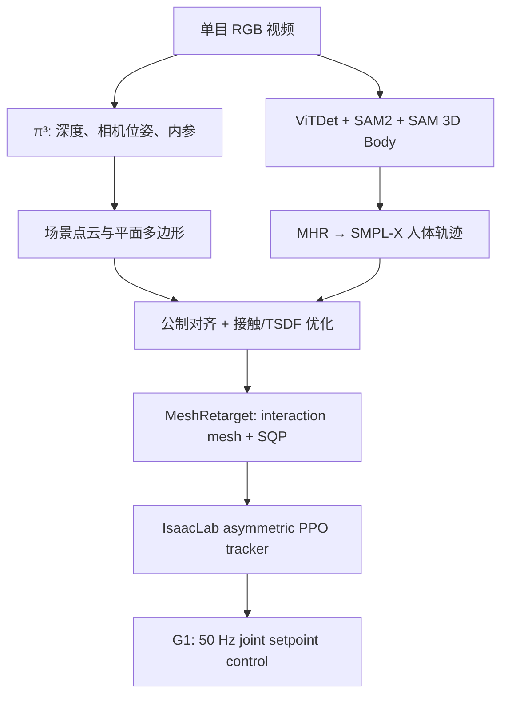

# MeshMimic 深度分析：从几何重建到场景交互式 Humanoid Tracking

> 论文：**MeshMimic: Geometry-Aware Humanoid Motion Learning through 3D Scene Reconstruction**  
> 项目页：<https://meshmimic.github.io/>  
> arXiv：<https://arxiv.org/abs/2602.15733>  
> 版本与核查日期：arXiv v1（2026-02-17）；开源状态核查于 2026-08-06  
> 分析视角：humanoid motion tracking、video-to-motion、3D reconstruction、motion retargeting、contact-rich control、sim-to-real 与复现

---

## 0. 结论先行

### 一句话总结

MeshMimic 的核心不是提出一个全新的 tracking policy，而是把**单目视频中的人体运动与场景几何共同恢复到同一个公制世界坐标系中，再通过接触保持的 MeshRetarget 生成机器人参考轨迹，最后用 BeyondMimic 风格的 RL tracker 在原场景中复现动作**。

### Elevator pitch

传统 MoCap 参考动作通常缺少地形几何，普通单目视频恢复的人体与场景又存在尺度不一致、漂移、悬空和穿模。MeshMimic 使用 $\pi^3$、SAM2 与 SAM 3D Body 分别恢复相机/场景和人体，再联合优化场景尺度与人体全局平移，并加入接触、TSDF 穿透、轨迹平滑和 foot-snapping 约束。随后，它用基于 interaction mesh 的逐帧 SQP 重映射，把人与地形的相对几何关系迁移到 Unitree G1，最后以非对称 PPO 训练 50 Hz 全身 tracking policy。它的真正贡献集中在**离线数据生成与几何约束**，而不是在线感知或底层 RL 架构。

### 综合评级

| 判断项 | 结论 | 原因 |
| --- | --- | --- |
| 论文生态位 | geometry-aware motion imitation / scene-interaction tracking | 上游是视觉重建与重映射，下游是场景特定的 whole-body tracking |
| 是否值得精读 | **值得重点精读** | 把 scene reconstruction、retargeting 与 tracking 的误差链路连接得很清楚 |
| 是否值得立即完整复现 | **谨慎，暂不建议全量复现** | 截至核查日，官方代码、数据与模型仍标为 Coming Soon |
| 是否值得局部借鉴 | **非常值得** | 公制对齐、接触约束、TSDF 双侧修正和几何质量评价都可独立落地 |
| 最核心贡献 | **把 motion 与 terrain 作为耦合参考数据共同优化** | 降低下游 RL 被迫“修复坏 reference”的负担 |
| 最大风险 | **已知场景的离线复现被包装成 terrain-aware perception** | actor 没有明确的在线地形观测，真机还在原采集场景中执行 |
| 当前复现优先级 | **中优先级：先做模块复现** | 先验证 reconstruction/retargeting 是否真的降低 tracking 难度 |

### 最应优先阅读的三处

1. **Sec. 3.2 Human–Scene Reconstruction**：决定输入 reference 是否物理可用。
2. **Sec. 3.3 MeshRetargeting**：决定人—场景接触如何跨 embodiment 保存。
3. **Sec. 4.2–4.3 Training / Deployment / Comparison**：暴露了 actor 的真实输入、外部定位依赖和实验边界。

---

## 1. 对初步笔记的校正与补全

| 初步表述 | 更准确的表述 | 判断 |
| --- | --- | --- |
| 估计相机内外参数 | $\pi^3$ 输出逐帧深度 $D^t$、camera-to-world pose $[R^t\mid t^t]$ 和共享内参 $K$ | 正确，但还需强调输出不是天然公制尺度 |
| 画面、地形重建 | 从背景点云得到场景，并用**平面多边形基元**近似；之后还构建可碰撞/可查询 TSDF 的几何 | 不是直接把原始稠密点云无损转成 mesh |
| 估计 simpl 格式 | 应为 **SMPL-X**；SAM 3D Body 先输出 MHR，再转换为 SMPL-X 参数 | 术语需修正 |
| 点云和 SMPL 对齐，尺度对齐 | 固定 SMPL-X pose/shape，优化每帧人体全局平移 $t^{0:T}$ 与单一场景尺度 $\alpha$ | 核心正确；不是完整 bundle adjustment |
| 重映射：GMR + 距离点控制 | 论文方法是**受 OmniRetarget 启发的 interaction mesh + Laplacian deformation + SQP**，并附加局部/全局 terrain sampling 与 TSDF correction | GMR 只在 related work 出现，不是 MeshRetarget 的直接实现 |
| 人选 24 个点，地面投影 24 个点 | v1 正文只写“对应的人/机器人解剖关键点 + 采样的物体和地形点”，**没有给出 24 这一固定数字，也不是简单地面投影点对** | 不能把 24 当作论文已公开超参数 |
| GMR 没有地形交互、接触交互、采样 | 这个批评适用于 scene-agnostic retargeter；MeshRetarget 通过 interaction mesh 显式加入全局及人体邻域地形点 | 方向正确，但对象应区分清楚 |
| 穿模需要特殊处理 | 有两层处理：人体重建阶段用 TSDF penetration loss；机器人重映射后再沿平均 SDF gradient 做全局平移修正 | 正确且是关键工程点 |

最重要的概念修正是：**MeshRetarget 不是“若干身体点到地面投影点的距离控制”**。它试图保持 interaction mesh 的 Laplacian coordinates，也就是身体关键点、地形点和物体点构成的局部邻接几何；距离关系只是这一表示隐含的一部分。

---

## 2. 论文解决了什么问题

### 2.1 问题定义

给定一段未标定的消费级单目 RGB 视频：

$$
\mathcal{I}=\{I^t\}_{t=0}^{T},
$$

希望恢复：

1. 世界坐标系中的人体运动 $\mathcal{M}_h=\{\theta^t,\phi^t,t^t,\beta\}$；
2. 与人体具有一致尺度和坐标系的场景几何 $\mathcal{G}$；
3. 人—场景的接触关系 $\mathcal{C}^{0:T}$；
4. 机器人可执行的参考轨迹 $\mathcal{M}_r=\{q_t,\dot q_t,T_{root,t}\}$；
5. 可在真实机器人上追踪该参考轨迹的策略 $\pi(a_t\mid o_t,c_t)$。

它要修复的并非单一 tracking error，而是一个串联误差链：

$$
\text{相机/深度误差}
\rightarrow \text{人体世界轨迹误差}
\rightarrow \text{接触与尺度误差}
\rightarrow \text{重映射不可行}
\rightarrow \text{RL 难以追踪}
\rightarrow \text{真机失效}.
$$

### 2.2 相对传统 imitation + RL 的新增部分

传统流水线通常是：

$$
\text{MoCap} \rightarrow \text{scene-agnostic retargeting} \rightarrow \text{RL tracking}.
$$

MeshMimic 改为：

$$
\text{RGB video}
\rightarrow \text{human + scene reconstruction}
\rightarrow \text{metric/contact optimization}
\rightarrow \text{scene-aware retargeting}
\rightarrow \text{RL tracking}.
$$

新意主要在前三步。它的假设是：**如果 reference motion 与 collision geometry 已经一致，接触丰富技能不必依靠复杂、任务特定的 reward engineering，也能被通用 tracker 学会。** 这个假设技术上合理，而且与 GMR、OmniRetarget 等工作的经验一致：reference quality 会显著影响长时程、动态和多接触动作的可追踪性。

### 2.3 学术 benchmark 还是部署问题

它比纯 benchmark 更接近真实部署，因为完成了 RGB capture → simulation → Unitree G1 的闭环，并加入 IsaacLab → MuJoCo 的 sim2sim 安全门。但它仍不是通用部署方案：

- 真机在**与采集视频相同的物理场景**中执行；
- actor 没有明确的实时视觉/点云/height map 输入；
- 长时程动作使用外部光学动捕提供全局躯干位置；
- 论文明确把“未知地形上的视觉闭环泛化”列为 future work。

因此更准确的定位是：**面向真实机器人的 scene-specific skill acquisition pipeline，而不是未知环境中的在线 terrain-aware controller。**

---

## 3. 方法总览：Input → Geometry → Motion → Action

### 3.1 数据生成侧的输入与输出

| 阶段 | 输入 | 中间表示 | 输出 |
| --- | --- | --- | --- |
| 场景视觉重建 | 多帧 RGB | depth map、point map、camera pose、intrinsics | 非公制场景点云/几何 |
| 人体检测与跟踪 | RGB | person box、SAM2 masklet | 跨帧人体实例 |
| 人体 mesh 恢复 | 人体 crop/mask | MHR，之后映射到 SMPL-X | $\beta,\theta^t,\phi^t,t^t,J^t_{3D}$ |
| 人—场景联合优化 | SMPL-X、2D joints、点云、相机参数 | contact set、TSDF、尺度 $\alpha$ | 公制一致、世界对齐的人体与场景 |
| MeshRetarget | 人体关键点、机器人模型、地形/物体点 | interaction mesh、Laplacian coordinates | 机器人 $q_t$、root pose、速度 |

### 3.2 控制侧的输入与输出

论文给出的 actor observation 包括：

- reference joint position / velocity；
- 未来若干步的 torso position / orientation error；
- projected gravity、torso angular velocity；
- joint position / velocity；
- 上述 proprioception 的 5-step history；
- previous executed action 的 5-step history。

critic 额外看到 torso linear velocity、body-link position/orientation 等 privileged state，以及论文所称的 privileged scene information。

actor 和 critic 都是四层 MLP：

$$
[3072,1536,768,512],
$$

并使用 5-step observation history 与 5-step future-motion horizon。

> **证据边界：**MeshMimic v1 没有明确写出 action 映射公式。由于作者明确称其采用 BeyondMimic-style formulation，最合理推断是输出归一化 joint-position setpoint，经低增益 impedance/PD 转成关节力矩。但这仍是推断，正式复现必须等官方配置或代码确认。

---

## 4. Human–Scene Reconstruction 深入拆解

### 4.1 相机与场景

$\pi^3$ 从多帧图像预测：

$$
\{D^t,[R^t\mid t^t],K\}_{t=0}^{T}.
$$

这里最关键的不是“得到一个看起来像场景的点云”，而是相机轨迹、深度与人体轨迹必须处于一致坐标系。原始输出仍存在尺度不确定性，且动态人体、遮挡、运动模糊会污染背景几何。

MeshMimic 没有直接保留噪声稠密 mesh，而是使用**平面多边形基元**逼近场景。它位于两个极端之间：

- 比单一平面、台阶/方盒等简单 primitive 更能描述非规则地形；
- 比对噪声点云直接 meshify 更平滑、更适合作为 collision geometry。

但这也带来先验偏置：岩石、曲面、细杆、软体或具有凹槽的场景不一定适合平面多边形近似。论文没有报告 polygon fitting 的阈值、分辨率、失败率或人工清理比例。

### 4.2 人体恢复

流程为：

1. ViTDet 检测目标人；
2. SAM2 做跨帧 identity association / segmentation；
3. SAM 3D Body 逐帧恢复 MHR；
4. 将 MHR 转换为 SMPL-X，得到局部姿态 $\theta^t$、shape $\beta$、3D joints $J^t_{3D}$、相机坐标中的全局朝向 $\phi^t$ 与平移 $t^t$。

关键限制是 SAM 3D Body 本质上仍是单帧 human mesh recovery。论文随后只优化**全局平移与场景尺度**，保持人体 pose/shape 固定。因此：

- 遮挡造成的肢体姿态错误不会被后续 kinematic consistency 自动修正；
- 手、脚姿态或接触肢体的局部错误会直接传到 retargeting；
- 轨迹平滑主要平滑 root translation，不能消除所有关节抖动。

### 4.3 深度边缘引导的接触估计

论文不使用容易在模糊/遮挡视频中失稳的 learned contact predictor，而从 silhouette 与 depth edge 构造接触带。

先对人体二值 mask 做 morphological gradient 得到 $E_{human}$，再膨胀 depth discontinuity $E_{depth}$ 得到排除区 $\tilde E_{depth}$：

$$
\mathcal{P}_{c}=
\left\{p\in\mathcal{P}_{human}
\mid E_{human}(p)=1\land \tilde E_{depth}(p)=0\right\}.
$$

随后再次小幅膨胀 $\mathcal{P}_c$ 以容忍投影噪声，并把投影落入该 band 的 background points 作为候选 scene contact。

这一启发式的直觉是：人体轮廓与背景在图像中相接、且没有显著深度断层时，更可能发生物理接触。它比纯 learned classifier 更稳定，但并不等价于真实接触：

- 图像相接可能只是遮挡或透视重合；
- 手掌按墙、脚踩水平面时不一定总形成稳定可见轮廓；
- 快速动作中的 motion blur 会同时污染 silhouette 与 depth edge；
- 它只能给出几何候选，不能给出法向力、摩擦状态或 stick/slip mode。

### 4.4 公制对齐

SMPL-X 身高提供人体公制先验。论文固定 $\beta,\theta^t$，优化每帧平移 $t^{0:T}$ 与单一场景尺度 $\alpha$：

$$
\mathcal{V}_h^t=H(\beta,\theta^t,t^t,\phi^t),
$$

$$
L_{align}=L_{J2d}+L_d.
$$

$L_{J2d}$ 是 SMPL-X joints 的 2D reprojection error；$L_d$ 是相机朝向的人体 vertices 与 metric human point set 之间的 symmetric Chamfer distance。只选择 vertex normal 与 view direction 夹角小于 $65^\circ$ 的 camera-facing vertices，以避免把人体背面错误匹配到可见点。

这一设计实用但假设较强：

- 单一 $\alpha$ 假设整个 scene 的尺度误差是全局一致的；
- 人体真实身高/shape 估错会把误差传给整个场景尺度；
- 只优化 translation，不能修复相机旋转、人体 global orientation 或局部 pose 的系统误差；
- symmetric Chamfer 在遮挡和错误前景分割下仍可能出现错误对应。

### 4.5 Kinematic Consistency Optimization

总目标为：

$$
L_{total}=
\lambda_{align}L_{align}
+\lambda_cL_c
+\lambda_pL_p
+\lambda_{sm}L_{sm}
+\lambda_{fs}L_{fs}.
$$

#### 接触损失

$$
L_c=
\frac{1}{\sum_t|\mathcal C^t|}
\sum_t\sum_{j\in\mathcal C^t}
\left\|\alpha c_j^t-v_{h,i_j^t}^t\right\|_2^2.
$$

作用：把预测接触的人体 vertex 锚定在公制场景 contact point，减少悬空。

风险：contact correspondence 错误时，它会把人体轨迹强行拉向错误表面；若接触预测集中于可见轮廓，可能忽略真实但被遮挡的支撑点。

#### 穿透损失

从背景点云与 oriented normals 构造 TSDF。约定 $d(v)>0$ 在物体外部，$d(v)<0$ 为穿透：

$$
p(v)=\max(0,-(d(v)+\tau)),
$$

$$
L_p=\frac{1}{|\mathcal V|}\sum_{v\in\mathcal V}\operatorname{Huber}(p(v)).
$$

slack $\tau$ 避免对极浅的噪声穿透过度反应；Huber penalty 限制坏 TSDF 带来的梯度爆炸。

#### 轨迹平滑

对 world translation $T^t=t_{cam}^t+t^t$ 同时惩罚速度和加速度：

$$
\begin{aligned}
L_{sm}={}&\frac{1}{N-1}\sum_{t=0}^{N-2}
\left\|(T^{t+1}-T^t)f\right\|_2^2\\
&+\frac{1}{N-2}\sum_{t=0}^{N-3}
\left\|(T^{t+2}-2T^{t+1}+T^t)f\right\|_2.
\end{aligned}
$$

这个项能压制 jitter 与 camera-induced drift，但权重过大时会抹平跳跃起落、急停、冲量接触等真实高频运动。

#### Foot snapping

当脚点在地表外、但处于窄邻域 $0<d(q_f^t)\le\tau_{contact}$ 时：

$$
L_{fs}=
\frac{1}{N}\sum_{t,f}
\mathbb I(0<d(q_f^t)\le\tau_{contact})d(q_f^t)^2.
$$

$L_{fs}$ 从正 SDF 侧把近地脚点吸到表面；$L_p$ 从负 SDF 侧把穿透点推出。两者形成“地表两侧”的互补修正。

### 4.6 这一阶段真正解决与未解决的内容

| 已解决 | 未解决 |
| --- | --- |
| 人体与场景公制尺度一致性 | 局部人体 pose 的系统错误 |
| root trajectory 的抖动和漂移 | 真实动力学可行性与接触冲量 |
| 悬空与 mesh penetration 的几何修正 | 摩擦、力、柔顺接触与材料属性 |
| 可作为 simulator collision 的干净地形 | 未知场景的在线重建与更新 |

---

## 5. MeshRetarget：几何交互如何迁移到机器人

### 5.1 不是 GMR，而是 interaction mesh

论文明确写的是“following OmniRetarget”。将以下顶点共同组成 interaction mesh：

- 人体/机器人的对应解剖关键点；
- 物体点；
- 全局场景采样点；
- 人体邻域的局部场景采样点。

若把 interaction mesh 顶点记作 $X$，图 Laplacian 记作 $L$，其典型目标可抽象为：

$$
E_{lap}(q_t)=\left\|LX_r(q_t)-LX_h(t)\right\|_W^2.
$$

它保存的是局部相对几何，而不是逐个复制人体关节角。机器人 morphology 改变时，只要关键点语义对应、interaction structure 被保留，就可在不同身高与肢体比例下保持“脚踩在哪里、手撑在哪里、身体相对障碍物在哪里”。

> 上式是对 OmniRetarget/interaction-mesh 思路的抽象表达；MeshMimic v1 没有公开完整 objective、邻接构造、权重和点数。

### 5.2 为什么需要局部 + 全局 terrain sampling

只采样全局地形点时，大场景中多数点离人体很远。即使机器人在局部台阶处严重错位，整体 Laplacian energy 仍可能变化不大。MeshMimic 因而额外采样人体邻域地形：

- global points 保持整体场景比例和方向；
- local points 提高接触区域的梯度与约束强度。

这是很有价值的工程修正。其本质类似 importance sampling：把优化预算集中到当前动作真正发生 interaction 的区域。

### 5.3 SQP 与硬约束

论文逐帧求解机器人 configuration $q_t$，并加入：

- collision avoidance；
- joint limits；
- velocity limits；
- stance-foot anchoring，抑制 foot skating。

可抽象为：

$$
\begin{aligned}
q_t^*=\arg\min_{q_t}\quad &E_{lap}(q_t)+E_{reg}(q_t,q_{t-1})\\
\text{s.t.}\quad
&q_{min}\le q_t\le q_{max},\\
&|q_t-q_{t-1}|/\Delta t\le \dot q_{max},\\
&g_{collision}(q_t,\mathcal G)\ge0,\\
&p_{stance}(q_t)=p_{stance}^{ref}.
\end{aligned}
$$

### 5.4 重映射后的 TSDF 穿模修正

人体无穿透不代表机器人无穿透，因为二者形态不同。论文先在 penetrating / near-surface robot vertices $\mathcal M$ 上平均 SDF gradient：

$$
u=
\frac{\frac{1}{|\mathcal M|}\sum_{v\in\mathcal M}\nabla d(v)}
{\left\|\frac{1}{|\mathcal M|}\sum_{v\in\mathcal M}\nabla d(v)\right\|_2},
$$

再令 $\Delta o=\eta u$，线搜索最小 $\eta\ge0$，使：

$$
\min_{v\in\mathcal V_r^t}d(v+\Delta o)\ge\tau_{safety}.
$$

优点是便宜、稳定、容易后处理。局限也很明显：

1. 只改全局 translation，不能修正单条肢体或姿态；
2. 多个穿透区域的 SDF gradient 可能相互抵消；
3. 把 root 整体移开可能破坏已经满足的手/脚接触；
4. 狭缝或双侧接触中可能不存在单一平移方向；
5. collision-free 不等于 dynamically feasible。

### 5.5 “contact-invariant”的准确含义

它保存的是**接触几何关系的近似不变性**，不是接触力学不变性。论文没有在 retargeting 中显式恢复：

- normal force；
- friction cone；
- center of pressure；
- impulse；
- stick/slip mode；
- torque feasibility 或 ZMP/centroidal dynamics。

因此更准确地说，MeshRetarget 是 **contact-geometry-aware kinematic retargeting**，而不是 contact-dynamics retargeting。

---

## 6. Tracking policy、action representation 与实时性

### 6.1 策略架构

| 项 | MeshMimic |
| --- | --- |
| RL 算法 | asymmetric PPO |
| 仿真器 | IsaacLab |
| actor / critic | 4-layer feed-forward MLP，hidden dims $[3072,1536,768,512]$ |
| 时序 | 5-step observation history；5-step future reference horizon |
| 参考输入 | joint pos/vel；未来 torso pos/orientation error |
| actor 物理观测 | projected gravity、torso angular velocity、joint pos/vel、previous action |
| critic privileged state | torso linear/angular velocity、body links pose、joint state，以及 privileged scene |
| policy 频率 | 50 Hz |
| 真机算力 | NVIDIA Jetson Orin |
| 推理延迟 | 论文未报告 |

网络本身没有 Transformer、RNN、diffusion 或显式 latent skill。5-step history 通过简单拼接提供有限时序信息，因此优先保证实时性和工程稳定性。

### 6.2 Action representation

MeshMimic 没有给出 action 方程。结合 BeyondMimic 的已公开实现，最可能是：

$$
q_{j,t}^{cmd}=\bar q_j+\alpha_j a_{j,t},
$$

再由低增益 joint impedance / PD 生成实际 torque。BeyondMimic 中：

$$
k_{p,j}=I_j\omega_n^2,\qquad
k_{d,j}=2I_j\zeta\omega_n,
$$

并令 $\alpha_j$ 与 torque limit 和 $k_p$ 关联。此时 position target 更像 torque-generating intermediate variable，而不是要求电机精确到达的高刚度位置命令。

**优点：**

- 比直接 torque policy 更容易训练和 sim2real；
- 保留一定 impact compliance，适合跳跃、撑手、落地；
- action dimension 与 G1 actuated joints 直接对应，部署简单；
- action-rate penalty 可自然抑制抖动。

**缺点：**

- 强依赖准确的 $k_p,k_d$、电机 torque limit、armature/reflected inertia 和低层执行行为；
- 高冲击时，固定 impedance 未必覆盖不同 contact mode；
- 若地形或 reference 有误，position setpoint 会持续驱动机器人撞向错误目标；
- 与特定 G1 morphology 和 actuator bandwidth 的耦合较强。

**小结：**若上述推断成立，MeshMimic 的 action 本质是**低增益 impedance 下的 normalized joint-position setpoint**。它重要的原因不是表达能力更强，而是为 RL tracking、接触柔顺性和真机部署提供较好的折中。

### 6.3 是否真的闭环

对**机器人状态**是闭环的：actor 每 20 ms 读取 proprioception 和 tracking error 并输出动作。对**环境变化**不是充分闭环的：

- 没有实时 RGB、depth、point cloud 或 height map actor input；
- scene geometry 主要作为离线 reference、sim collision geometry 和 critic privileged information；
- 在真实部署中使用与采集相同的场景。

因此闭环难度分两种：

| 目标 | 难度 | 说明 |
| --- | --- | --- |
| 已知场景、已知 reference 的状态反馈 tracking | 中 | 50 Hz MLP 可实时，但依赖标定、全局定位与硬件模型 |
| 未知/变化场景的在线几何闭环 | 高 | 论文尚未实现在线 terrain perception、registration 与 replanning |

---

## 7. 接触、力与物理一致性

### 7.1 模型是否显式理解力

没有。论文没有给 actor 输入 force/torque sensor、足底六维力、触觉或显式 contact state，也没有学习 contact-force estimator。

它通过三种间接机制“理解接触”：

1. **离线几何约束**：接触点、TSDF、stance-foot anchoring；
2. **仿真接触动力学**：IsaacLab rollout 中的碰撞和摩擦；
3. **tracking reward**：若参考轨迹只能通过正确接触完成，RL 会隐式学到相应 action pattern。

所以它学到的是“在特定 reference 与场景下，什么 proprioceptive action pattern 能维持运动”，而非显式 contact physics model。

### 7.2 Reward

论文列出的 reward 很少：

- anchor position / velocity / orientation tracking；
- body position / orientation / linear velocity / angular velocity tracking；
- action-rate penalty；
- soft joint-limit penalty。

没有单独的 foot contact、anti-slip、energy、force tracking 或 task-specific collision reward。论文据此声称高质量 reference 可降低 reward shaping 负担。这个方向可信，但证据还不充分，因为：

- reward 的准确公式、权重和 bandwidth 未公开；
- critic 有 privileged scene，贡献没有单独消融；
- 50 小时通用 motion pretraining 本身是很强的先验；
- hard termination 和 adaptive sampling 也会显著改变学习难度。

### 7.3 接触控制强不强

| 层级 | 强度 | 判断 |
| --- | --- | --- |
| 接触几何恢复 | 强 | contact band + TSDF + foot snapping 有明确设计 |
| 接触保持重映射 | 中到强 | interaction mesh、stance anchoring、局部采样很实用 |
| 接触动力学建模 | 弱 | 无显式力、摩擦锥、冲量或 centroidal constraint |
| 在线接触感知与适应 | 弱 | actor 依赖 proprioception 隐式反应，没有 terrain/contact sensor 输入 |

---

## 8. 训练数据、训练策略与 sim2real

### 8.1 训练阶段

1. 使用约 **50 小时非交互人体 motion** 预训练 generic whole-body tracker；
2. 将单目视频经过 reconstruction + MeshRetarget 得到 scene-interactive references；
3. 在复杂碰撞场景中 fine-tune；
4. 使用 BeyondMimic-style motion-bin adaptive sampling，加强失败/困难时间段；
5. 在 IsaacLab 训练，先过 IsaacLab → MuJoCo sim2sim gate；
6. 部署到 Unitree G1。

论文在比较实验中使用 **2048 个并行环境、40k PPO iterations**。没有报告 GPU 型号、wall-clock time、physics step、control decimation、batch size 或总 samples。

### 8.2 Domain randomization

论文公开的项包括：

- robot body material randomization；
- torso COM：$x\pm0.025$ m，$y\pm0.05$ m，$z\pm0.05$ m；
- joint default position：$\pm0.01$ rad；
- random push：$0.3$ m/s、$0.78$ rad/s，持续 1–3 s。

未明确报告 actuator strength、latency、sensor noise、motor friction、battery voltage、link mass/inertia 等常见 randomization。若实际使用但未写，将直接影响复现；若确实未使用，则说明 reference quality、机器人模型和真实硬件一致性承担了更大作用。

### 8.3 外部定位依赖

论文说数据采集只需消费级单目相机，这一点成立；但**长时程真机部署使用光学 motion-capture system 获取 global torso position**。两件事不能混为一谈：

- no MoCap for demonstration capture；
- MoCap can still be required for deployment state estimation。

Table 3 显示 global position 对长时程 JB2、CB1、JCD1 分别提升 20、20、30 个百分点，却让 SV1、SV2、CB2 分别下降 20、20、30 个百分点。八项简单平均从无位置的 71.25% 变为有位置的 70%，说明它不是普适增益，而是一个**长程漂移与高动态噪声之间的折中**。

---

## 9. 实验是否支撑 claim

### 9.1 Reconstruction benchmark

在 SLOPER4D 子集上：

| 方法 | WA-MPJPE ↓ | W-MPJPE ↓ | Chamfer Distance ↓ |
| --- | ---: | ---: | ---: |
| WHAM | 189.29 | 1148.49 | – |
| TRAM | 149.48 | 954.90 | 10.66 |
| VideoMimic | 112.13 | 696.62 | 0.75 |
| MeshMimic | **94.32** | **518.98** | **0.61** |

相对 VideoMimic，WA-MPJPE、W-MPJPE 与 Chamfer 分别改善约 15.9%、25.5% 和 18.7%。这支持“人体世界轨迹与场景几何更准”的 claim。

但 benchmark 很小且经过筛选：

- 只取 running、walking、stairs 三类，每类两段，共六段；
- 只保留 **SAM2 tracking 成功**的序列；
- 没有报告 contact precision/recall、penetration depth、foot sliding 或 surface normal error；
- Chamfer 只在 RGB camera FOV 内、对齐后的 point cloud 上计算，可能弱化全局 scale/pose 错误。

因此它证明了“在可被上游 tracker 成功处理的短列表中，几何指标更好”，尚未证明 in-the-wild pipeline 的端到端成功率。

### 9.2 Real2Sim2Real tasks

八项任务覆盖：flat walk、40 cm box jump、running single-leg jump、50/60 cm climb、single/double-hand safety vault，以及多阶段 jump-climb-down。每项真机 10 次，完整无人工干预才算 success。

论文 Table 3 中使用 global position 时的 success rate 为：

| Walk1 | JB1 | JB2 | SV1 | SV2 | CB1 | CB2 | JCD1 |
| ---: | ---: | ---: | ---: | ---: | ---: | ---: | ---: |
| 100% | 90% | 100% | 50% | 80% | 40% | 70% | 30% |

这组结果很有展示价值，但不应概括为“所有复杂场景稳定成功”。高度动态 SV1 和长时程 CB1/JCD1 仍明显困难。

### 9.3 比较设计的优点

- 通过 MMM+MMT、VMM+MMT、VMM+VMT 区分 motion 与 terrain reconstruction 的作用；
- 报告 simulation reward 与 real-world success rate；
- 用 MuJoCo sim2sim 作为危险动作上真机前的 gate；
- 真实机器人每场景做 10 次，而非只展示单个视频。

### 9.4 比较设计的不足

1. 缺少完整 $2\times2$ factorial 中的 **MMM+VMT**，无法完全分离 motion/terrain 主效应与交互项；
2. simulation mean reward 由自身 reward 定义，不是跨方法中立指标；
3. 未报告置信区间、随机种子、方差或统计检验；
4. 真机只测同一 capture scene，不含新地形、尺寸扰动、障碍物偏移或定位误差 sweep；
5. 没有 actor terrain observation，无法证明在线地形适应；
6. 没有与 OmniRetarget、GMR+terrain correction、VideoMimic+同一 tracker 等更细粒度 baseline 对齐；
7. 没有说明是一项任务一个 fine-tuned policy，还是统一 multi-task policy；
8. 未量化外部 MoCap 的延迟、抖动和 occlusion rate。

### 9.5 实验可信度判断

| Claim | 支撑程度 | 说明 |
| --- | --- | --- |
| reconstruction 比 VideoMimic 更准 | 中到强 | 数值明确，但样本小且筛选 |
| 更好的 reference 更容易被 RL 追踪 | 中 | 三种组合有趋势，但缺完整 factorial 和多 seed |
| 可在真实 G1 上执行复杂地形动作 | 强 | 有八类任务与重复试验 |
| 能在 arbitrary outdoor scenarios 泛化 | 弱 | 没有 unseen-scene 部署 |
| 机器人在线感知并理解 terrain | 弱 | actor 无明确 terrain perception 输入 |
| 只靠消费级单目相机即可完成整个部署闭环 | 弱 | 长时程部署仍使用 optical MoCap global position |

---

## 10. 消融实验：已有与缺失

### 已有

- MeshMimic motion vs VideoMimic motion；
- MeshMimic terrain vs VideoMimic terrain（但组合不完整）；
- global torso position observation on/off。

### 最应该补的消融

1. $L_c$、$L_p$、$L_{sm}$、$L_{fs}$ 逐项去除；
2. depth-edge contact vs learned contact vs no contact；
3. 只用 global terrain points vs global + local points；
4. 有/无 robot TSDF post-correction；
5. actor/critic 是否使用 scene privileged information；
6. 从 scratch vs 50 h generic tracker pretraining；
7. 1-step vs 5-step history/future horizon；
8. 有/无 motion adaptive sampling；
9. 仅公制 alignment vs 完整 kinematic consistency；
10. 相同 tracker、相同 reward、相同 mesh 下比较 GMR、OmniRetarget 与 MeshRetarget。

如果只能保留一个创新点，应保留：**把接触、穿透与公制尺度统一纳入 human–scene joint optimization，并验证其对下游 tracking 的影响。**

---

## 11. 局限、失败模式与组会质疑

### 11.1 最大局限

MeshMimic 的几何主要被“编译”进 scene-specific reference 和 simulator，而不是作为在线 actor observation。策略可能学到“在已知相位、已知轨迹、已知场景上如何复现动作”，但不能据此推断它能对新台阶高度、障碍位置变化或未知地形实时调整。

### 11.2 典型失败模式

- SAM2 identity/mask 失败，整条数据管线被筛掉；
- 快速相机运动、motion blur、遮挡导致 root drift 或局部 pose 错；
- 人体身高/shape 先验错误导致场景尺度整体偏差；
- 平面多边形丢失局部凸起/凹槽；
- contact band 把视觉接近误判为物理接触；
- 单一 root translation 无法同时修正多肢体穿透；
- external MoCap occlusion 在快速撑手/翻越中放大噪声；
- 长时程 phase/global-position drift 使机器人“错相位”到达障碍物；
- 真实障碍与 reconstructed mesh 的厘米级错位造成接触时序崩溃。

### 11.3 最值得在组会上问的五个问题

1. **actor 完全不看实时 terrain，为什么称为 terrain-aware control，而不是 scene-conditioned reference tracking？**
2. **SLOPER4D 只选 SAM2 成功的六个序列后，上游端到端成功率到底是多少？**
3. **为什么缺少 $L_c/L_p/L_{sm}/L_{fs}$ 和 local terrain sampling 的逐项消融？**
4. **数据采集宣称 no MoCap，但部署使用 optical MoCap；不用外部全局定位时，长时程任务能否可靠完成？**
5. **同场景成功能否迁移到障碍高度、位姿、摩擦系数或相机重建误差发生变化的场景？**

---

## 12. 与 BeyondMimic 对比

| 对比维度 | MeshMimic | BeyondMimic | 分析 |
| --- | --- | --- | --- |
| 研究目标 | 从单目视频获得 motion–terrain 技能并在原场景复现 | 大规模高质量 motion tracking，并用 guided diffusion 组合技能 | MeshMimic 解决数据与几何；BeyondMimic 解决 tracker 与生成控制 |
| 方法类别 | real-to-sim-to-real + reconstruction + retargeting + RL | motion tracking RL + offline diffusion distillation | 两者不是同层替代关系 |
| 上游数据 | consumer monocular RGB | MoCap/retargeted motion library | MeshMimic 更低成本但噪声更大 |
| 环境表示 | reconstructed scene mesh / TSDF | tracking 阶段主要 scene-agnostic；diffusion 可用 SDF guidance | MeshMimic 把几何写入 reference；BeyondMimic 把几何用于 test-time cost 的潜力更强 |
| actor observation | ref q/qd、future torso error、5-step proprio/action history | ref q/qd 作为 phase、anchor error、single-step proprio、last action | MeshMimic 加历史与未来 horizon |
| 策略架构 | 4-layer MLP asymmetric PPO | tracking policy + guided state-action diffusion | MeshMimic 没有生成式控制层 |
| 动作表示 | 论文未明确；推断为 normalized joint setpoint | 明确为 normalized joint-position setpoint + low impedance | MeshMimic 复用风格但证据需代码确认 |
| 是否依赖参考动作 | 是，且 reference 与场景绑定 | tracking 是；diffusion 可生成/组合新轨迹 | BeyondMimic 更接近“beyond tracking” |
| tracking 强调 | 强 | 很强，是核心基座 | MeshMimic 的 tracking 创新较少 |
| 接触 | 几何层显式、动力学层隐式 | tracking 中主要隐式；diffusion 可用 SDF avoidance | MeshMimic 对原始接触位置更强 |
| 地形泛化 | 未证明；同 capture scene | flat/scene-agnostic tracker 更通用，SDF guidance 支持任务级避障 | 两者都未自动解决未知复杂接触地形 |
| sim2real | pretrain + scene fine-tune + DR + IsaacLab→MuJoCo gate | targeted DR、低阻抗 action、500 Hz state estimator、C++/ONNX | BeyondMimic 的部署工程公开更完整 |
| 外部定位 | 长时程使用 optical MoCap torso position | 不依赖外部 MoCap；极端动作可用 LIO 或移除相关观测 | BeyondMimic 的自主性更强 |
| 真机 | Unitree G1，8 个 scene-interaction tasks | Unitree G1，多类长序列动态 motion + downstream tasks | 验证重点不同 |
| 实时性 | 50 Hz，Jetson Orin；延迟未报 | CPU ONNX inference <1 ms；state estimator 500 Hz | BeyondMimic 工程证据更完整 |
| 开源状态 | 截至 2026-08-06 仍 Coming Soon | tracking 与 C++ inference 已开源 | 当前复现差距很大 |
| 主要优点 | reference 与 terrain 几何一致、接触位置更可信 | 通用 tracker、部署完整、可通过 diffusion guidance 组合任务 | 可组合为更强系统 |
| 主要缺点 | scene-specific、外部定位、无官方代码 | 原始 motion 通常缺少真实场景接触几何 | 两者正好互补 |

### 研究哲学差异

- **MeshMimic：先把数据做对。** 尽量把接触与地形一致性放进 reference，减轻 RL 的负担。
- **BeyondMimic：先把 tracker 做成通用基座，再用 generative policy 和 test-time guidance 组合能力。**

若目标是近期落地，BeyondMimic 的公开 tracker/部署栈更可用；若目标是从互联网视频挖掘接触技能，MeshMimic 的 reconstruction + retargeting 更值得借鉴。理想路线不是二选一，而是：

$$
\text{MeshMimic data engine}
+\text{BeyondMimic tracker}
+\text{online geometry-conditioned policy}.
$$

---

## 13. 开源代码搜索与仓库审查

### 13.1 搜索结论

截至 2026-08-06，MeshMimic 项目页仍显示：

- `Code (Coming Soon)`；
- `Data and Model (Coming Soon)`。

**未找到可信的官方 MeshMimic 实现，也未找到可以验证与论文逐项对应的第三方复现。** 因此不能按附件提示词要求去审查一个并不存在的 MeshMimic repo 的目录、训练脚本、config、checkpoint 或 issue。

### 13.2 候选仓库

| 仓库 | 类型 | 与 MeshMimic 的关系 | 完整度 | 可信度 | 备注 |
| --- | --- | --- | --- | --- | --- |
| [MeshMimic project](https://meshmimic.github.io/) | 官方项目页 | 论文直接对应 | 低 | 高 | 只有论文、视频和交互结果；代码/数据/模型未发布 |
| [hongsukchoi/VideoMimic](https://github.com/hongsukchoi/VideoMimic) | 官方 baseline repo | 最接近的端到端替代实现 | 中 | 高 | real2sim、simulation、sim2real 都有；但作者注明部分 end-to-end stages 未充分测试 |
| [HybridRobotics/whole_body_tracking](https://github.com/HybridRobotics/whole_body_tracking) | 官方 BeyondMimic tracking repo | MeshMimic 下游 tracker 的最接近公开基座 | 高 | 高 | IsaacLab 2.1、训练/评估/config/MDP 结构明确 |
| [HybridRobotics/motion_tracking_controller](https://github.com/HybridRobotics/motion_tracking_controller) | 官方 BeyondMimic deployment repo | G1 C++/ONNX 真机部署参考 | 高 | 高 | ROS 2 Jazzy、MuJoCo sim2sim 与真机 launch 完整 |
| [yyfz/Pi3](https://github.com/yyfz/Pi3) | 官方上游 repo | MeshMimic 的 scene reconstruction 组件 | 高（组件级） | 高 | inference/checkpoint/training/eval 分支可用；weights 为 CC BY-NC 4.0 |
| [facebookresearch/sam-3d-body](https://github.com/facebookresearch/sam-3d-body) | 官方上游 repo | 人体 mesh 恢复 | 中到高（inference） | 高 | checkpoint 需申请访问；主要是单图 inference，不含 MeshMimic 的联合优化 |
| [amazon-far/holosoma](https://github.com/amazon-far/holosoma) | OmniRetarget 官方代码入口 | interaction-preserving retargeting 与 RL 的最近公开实现 | 高 | 高 | 有 docs、tests、Docker、多 simulator；不含 MeshMimic 的特有视觉/TSDF 改造 |
| [YanjieZe/GMR](https://github.com/YanjieZe/GMR) | 官方 retargeting baseline | 可作 scene-agnostic baseline，不是 MeshRetarget 实现 | 高 | 高 | 多机器人、多格式、MIT；不能替代 interaction mesh terrain retargeting |

### 13.3 最可信、最适合复现与替代方案

1. **最可信的官方实现：不存在，尚未发布。**
2. **最适合实际搭建近似系统：VideoMimic + Pi3 + SAM 3D Body + BeyondMimic tracking。**
3. **最接近 MeshRetarget 的替代实现：Holosoma 中的 OmniRetarget retargeting。**
4. **最适合做无场景重映射 baseline：GMR。**

### 13.4 复现视角质量审查

| 审查项 | MeshMimic 官方 | VideoMimic | BeyondMimic tracking/deploy | Pi3 / SAM 3D Body | Holosoma |
| --- | --- | --- | --- | --- | --- |
| README / 安装 | 低 | 中 | 高 | 高 | 高 |
| 依赖版本 | 低 | 中 | 高：IsaacLab 2.1、ROS 2 Jazzy | 中到高 | 高：setup scripts / lockfile |
| 代码结构 | 低 | 中到高：real2sim/simulation/sim2real | 高：MDP、config、robot、C++ deploy 分离 | 高（各自组件） | 高：train/inference/retargeting 分离 |
| 训练入口 | 低 | 中：四阶段脚本 | 高：train/play 命令明确 | Pi3 有 training branch；SAM 3D Body 主要 inference | 高 |
| 数据/资产 | 低 | 中：视频、checkpoint 可下载 | 中到高：LAFAN/Unitree motion + WandB registry | 中：weights/licence/access 条件 | 中到高 |
| checkpoint / eval | 低 | 中到高 | 中：可从 WandB/公开数据训练，部署 repo 完整 | 高（组件级） | 中到高 |
| 真机代码 | 低 | 中：作者称未充分清理/测试 | 高：C++ ONNX、MuJoCo、G1 launch | 不适用 | 高 |
| 与论文完全对齐 | 低 | 不适用 | 不适用 | 不适用 | 不适用 |

**总体结论：**MeshMimic 当前属于“论文方法可读，但官方复现基本不可用”；替代仓库足以搭建近似系统，却不能验证论文的关键超参数、polygon fitting、contact correspondence、KCO 权重、MeshRetarget graph/constraints、scene fine-tuning config 与真机定位接口。

### 13.5 最大的代码缺口

- $\pi^3$ 输出如何清理并拟合 planar polygons；
- MHR → SMPL-X 的精确转换；
- depth-edge contact correspondence；
- joint optimization 的 solver、初始化、loss weights、阈值；
- watertight mesh / TSDF 的分辨率与符号方向处理；
- interaction mesh 的关键点数、terrain point sampling、邻接和权重；
- SQP hard constraints 与 stance detection；
- robot TSDF correction 的容差和 line-search 细节；
- actor/critic scene representation；
- action scaling、PD gains、physics/control frequency；
- 50 h pretraining motion 资产与 scene fine-tuning config；
- optical MoCap → torso global position 的实时滤波与坐标标定。

---

## 14. 真实复现难度

| 维度 | 难度 | 说明 |
| --- | --- | --- |
| 读懂方法 | 中 | 每个组件概念不难，但跨视觉、几何优化、RL 与真机 |
| 环境搭建 | 高 | 多套上游 repo、CUDA/PyTorch/IsaacLab/ROS/SMPL-X 许可与版本 |
| 仿真器对齐 | 高 | IsaacLab collision mesh、TSDF、MuJoCo sim2sim、G1 参数 |
| 数据/资产获取 | 高 | MeshMimic 数据未发；SAM 3D Body 权重需访问；50 h motion 未明确 |
| reconstruction 对齐 | 高 | polygon fitting、尺度、contact、TSDF 实现均缺代码 |
| reward 重建 | 中到高 | 类别公开，但准确公式、权重和 threshold 未公开 |
| action interface | 中到高 | 推断为 BeyondMimic-style，但 MeshMimic 未明确 |
| retargeting | 高 | MeshRetarget 特有 sampling、SQP、TSDF correction 未开源 |
| 训练稳定性 | 高 | 复杂 mesh contact 降低并行效率；40k iterations，2048 envs |
| benchmark 对齐 | 高 | SLOPER4D 具体子集与过滤规则未给列表 |
| sim2real | 高 | actuator/state-estimation/global-position 标定高度工程化 |
| 真机复现 | 极高 | G1、Jetson/外部计算、光学 MoCap、真实同构障碍和安全设施 |

主要困难是**工程难 + 数据难 + 隐含实现难 + 硬件难**，而不是 PPO 算法本身难。没有原作者代码时，它更接近“需要长期工程投入的研究型复现”，完整真机对齐很难作为普通学生课程项目完成。

---

## 15. 分层复现路线

### Level 1：最小可运行复现（建议立即做）

**目标：**不追求 MeshMimic 数值复现，只证明“geometry-consistent reference 比 scene-agnostic retargeting 更容易被 tracker 学会”。

**路线：**

1. 从 VideoMimic 的一段公开简单 staircase/box video 开始；
2. 跑通 Pi3 或直接使用 VideoMimic scene point cloud；
3. 跑通 SAM 3D Body，得到人体 mesh；
4. 先手工/半自动做 metric scale 与 root alignment；
5. 用 GMR 生成 baseline reference；
6. 用 Holosoma/OmniRetarget 或简单 terrain-aware IK 生成 geometry-aware reference；
7. 在 MuJoCo/IsaacLab 中计算 penetration、contact distance、foot slip；
8. 用 BeyondMimic tracker 对两种 reference 做相同预算训练。

**最小依赖：**Ubuntu 22.04、CUDA、24–48 GB VRAM GPU、Pi3、SAM 3D Body、SMPL-X、MuJoCo、IsaacLab 2.1、BeyondMimic tracking。

**成功标准：**

- 场景与人体尺度误差可视上正确；
- reference 在 simulator 中无明显脚悬空/大穿透；
- geometry-aware reference 的 tracking reward、episode length 或 success rate 明显优于 GMR baseline；
- 所有中间产物可缓存并可视化。

### Level 2：论文级复现

**必须补齐：**

- depth-edge contact band 与 2D→3D correspondence；
- joint metric alignment；
- $L_c,L_p,L_{sm},L_{fs}$；
- planar polygon reconstruction；
- local/global terrain sampling interaction mesh；
- SQP hard constraints；
- robot TSDF correction；
- 50 h generic tracker pretraining；
- 2048 env / 40k PPO iteration scene fine-tuning；
- IsaacLab→MuJoCo sim2sim gate；
- optical MoCap global torso state pipeline。

**优先对齐指标：**

1. SLOPER4D W-MPJPE / WA-MPJPE；
2. scene Chamfer；
3. contact precision/recall、penetration depth、foot slip（即便论文没报，也必须内部监控）；
4. sim tracking success 与 mean episode length；
5. 真机 task SR。

**最可能无法完全复现的部分：**作者的视频筛选/人工清理、polygon fitting、MeshRetarget 超参数、G1 动力学参数、外部 MoCap filter 与安全部署细节。

### Level 3：扩展研究

最有价值的升级不是继续对同一场景做更高 tracking reward，而是把离线几何变成在线条件：

1. actor 输入 robot-centric height map / local point cloud / SDF latent；
2. reference 用相对接触目标而不是绝对世界轨迹；
3. 用在线 scene registration 修正 obstacle pose 与 scale；
4. 显式估计 contact state，并加入足底力/触觉；
5. 将 global torso position 替换为 onboard LIO/VIO + contact-aided estimator；
6. 训练时对 obstacle pose、height、scale、friction 做 systematic augmentation；
7. 在 unseen geometry split 上评估，而非同场景重放。

---

## 16. 具体复现计划表

| 阶段 | 目标 | 关键任务 | 依赖 | 主要风险 | 预计产出 |
| --- | --- | --- | --- | --- | --- |
| 第 1 阶段 | 环境与组件跑通 | Pi3、SAM 3D Body、SMPL-X、VideoMimic sample、MuJoCo 可视化 | 1 张 24–48 GB GPU | 版本/权重/许可；坐标 convention | 缓存的 camera、point cloud、SMPL-X 与 scene mesh |
| 第 2 阶段 | baseline 评估 | GMR retarget；BeyondMimic tracker；flat/box 单任务 | IsaacLab 2.1、G1 model | action/gain 不对齐 | scene-agnostic baseline 指标 |
| 第 3 阶段 | 几何关键模块 | metric alignment、contact、TSDF、foot snap、terrain-aware retarget | differentiable geometry / SQP | correspondence 与 SDF 符号错误 | geometry-aware reference + 自动 QA |
| 第 4 阶段 | 论文关键结果 | 2048 env fine-tune；多 seed；IsaacLab→MuJoCo | A100/H100 级 GPU | mesh contact 慢、训练方差 | tracking/success/penetration 对比 |
| 第 5 阶段 | 真机与扩展 | G1、state estimation、场景注册、在线 terrain input | G1、Jetson/PC、安全架、MoCap 或 LIO | 硬件损伤、延迟、坐标漂移 | 1–2 个低风险任务和 unseen-geometry 结果 |

### 资源预算估计

> **论文与代码未明确给出完整资源，以下为基于类似 humanoid RL 与视觉重建项目的经验估计。**

| 范围 | 最低资源 | 时间估计 | 最耗资源 | 最耗人工 |
| --- | --- | --- | --- | --- |
| Level 1 | 1×RTX 4090/RTX 6000 Ada（24–48 GB），16–32 CPU cores | 1–3 周 | SAM/Pi3 推理与首次 tracker 训练 | 坐标系、尺度、mesh/TSDF QA |
| Level 2 单场景 | 1×A100/H100 80 GB 或 2–4×4090 | 3–8 周 | 2048 env、40k PPO、多个 seed | MeshRetarget 与 reward/config 对齐 |
| Level 2 八场景 | 2–4×A100/H100 + 大量并行存储 | 2–4 月 | 多技能 fine-tune 与 ablation | 数据清洗、失败分析、sim2real |
| 真机 | G1 + Jetson/外部 PC + 安全架 + 定位系统 | 额外 1–3 月 | 重复试验与模型迭代 | state estimation、标定与安全流程 |

### 复现优先级

**中优先级。** 值得复现的是 reconstruction → retargeting → tracking 的因果链，而不是当前就追求八项真机动作。建议以以下 go/no-go gate 管理：

1. geometry-aware reference 是否显著降低 penetration / slip；
2. 在相同 tracker 与训练预算下是否提高 success；
3. 对 ±5–10 cm obstacle perturbation 是否仍有收益；
4. 若前三项成立，再进入真机。

---

## 17. 对后续研究的具体建议

### 17.1 最值得做的统一 benchmark

固定同一个 G1、同一个 tracker、同一个 action/gain 和训练预算，只替换 reference/data engine：

| Data / Retargeter | Flat motion | Known terrain | Perturbed terrain | Unseen terrain |
| --- | --- | --- | --- | --- |
| GMR | ✓ | ✓ | ✓ | ✓ |
| VideoMimic retarget | ✓ | ✓ | ✓ | ✓ |
| OmniRetarget | ✓ | ✓ | ✓ | ✓ |
| MeshMimic-like | ✓ | ✓ | ✓ | ✓ |

统一记录：

- kinematic fidelity：MPJPE、root drift、joint-limit violation；
- geometric consistency：penetration depth/volume、contact distance、foot slip；
- dynamic feasibility：required torque、friction-cone violation、CoM/support margin；
- RL learnability：sample-to-success、failure-bin distribution、seed variance；
- real transfer：SR、contact timing error、global pose drift、impact peak。

### 17.2 与 System0 / tracking 路线的关系

若把 MeshMimic 放入“几何信息 + tracking”技术路线，它更适合被看作 **System1/reference generator 与 System0 tracker 之间的数据编译器**：

$$
\text{video + geometry}
\xrightarrow{\text{MeshMimic data engine}}
\text{contact-grounded reference}
\xrightarrow{\text{System0 tracker}}
\text{actuator command}.
$$

它给 System0 的启示是：

- 高质量 reference 可以减少 low-level reward engineering；
- 几何接触应在 reference、observation 和 safety constraint 三处都有表示；
- 仅把几何离线写入 reference 不足以处理现实偏差；
- System0 若要真正 terrain-aware，应接收 robot-centric local geometry/contact belief，并提供可解码的 contact/penetration/safety estimate。

---

## 18. 最终判断

### 最值得学习的三点

1. **把重建误差当作控制问题的上游瓶颈，而不是要求 RL 默默修复坏 reference。**
2. **用接触、TSDF 穿透和 foot snapping 对人体—场景做双侧几何约束。**
3. **用 global + local terrain sampling 提升 interaction-mesh retargeting 对大场景局部接触的敏感性。**

### 最不值得高估的三点

1. 它没有证明未知地形的在线视觉闭环泛化；
2. 它没有显式建模接触力学，主要是 contact geometry + implicit RL；
3. 它没有提出一个明显新于 BeyondMimic 的 tracking/action architecture。

### 综合结论

- **是否值得精读：值得。**
- **是否值得复现：谨慎；优先模块复现，等待官方代码再做论文级复现。**
- **是否值得借鉴到自己的研究：值得，尤其是 geometry QA、contact-grounded retargeting 与 reference-quality benchmark。**

> **一句话结论：**MeshMimic 本质上是一篇以**几何一致的数据生成与重映射**增强 scene-specific humanoid tracking 的工作；它真正的价值在于把人体、地形与接触从视频中恢复成“可被物理追踪的 reference”，但上限在于 actor 尚未形成未知环境中的在线几何闭环，而且当前官方实现未开放。

---

## 参考资料

1. [MeshMimic project page](https://meshmimic.github.io/)
2. [MeshMimic paper (arXiv:2602.15733)](https://arxiv.org/abs/2602.15733)
3. [BeyondMimic project](https://beyondmimic.github.io/)
4. [BeyondMimic paper](https://arxiv.org/abs/2508.08241)
5. [BeyondMimic motion tracking code](https://github.com/HybridRobotics/whole_body_tracking)
6. [BeyondMimic C++ inference controller](https://github.com/HybridRobotics/motion_tracking_controller)
7. [VideoMimic project](https://www.videomimic.net/)
8. [VideoMimic code](https://github.com/hongsukchoi/VideoMimic)
9. [$\pi^3$ code](https://github.com/yyfz/Pi3)
10. [SAM 3D Body code](https://github.com/facebookresearch/sam-3d-body)
11. [OmniRetarget project](https://omniretarget.github.io/)
12. [Holosoma / OmniRetarget code](https://github.com/amazon-far/holosoma)
13. [GMR code](https://github.com/YanjieZe/GMR)
14. [Retargeting Matters paper](https://arxiv.org/abs/2510.02252)
